# Voice Bridge - Implementation Plan

## Executive Summary

**Overall Feasibility: YES - Highly Attainable**

Voice Bridge is a real-time multi-language translation system with **voice intonation matching** as the primary differentiator. The requirements are feasible and well-architected for a 2025 JS/Electron/WASM ML stack.

**Architecture: Client-Server Separation**

The system follows a **client-server model** where:

- **Server** (the workhorse): Handles all heavy ML processing, model management, and translation pipeline execution. Can run locally or on remote machines.
- **Client** (configuration UI): Lightweight Electron app focused on configuration, session management, and monitoring. Multiple clients can connect to a single server.

### Project Scope (Clarified Requirements)

**Core Features:**

1. ✅ Multi-client support via GraphQL API with subscriptions
2. ✅ Three simultaneous languages: Spanish, Chinese, Korean
3. ✅ **Voice intonation matching and mimicry (XTTS-v2) - PRIMARY GOAL**
4. ✅ Streaming for text translation and audio output
5. ✅ On-demand model downloads (not bundled with application)
6. ✅ Multi-format audio input (WAV, MP3 via ffmpeg)
7. ✅ Decoupled architecture with model swapping capability

**Technology Stack (User-Confirmed):**

- **UI Framework**: React + TypeScript + Material UI (MUI)
- **Build Tool**: Vite
- **VAD**: Silero VAD
- **ASR**: Parakeet TDT (via Transformers.js)
- **Translation**: NLLB-200 (via Transformers.js)
- **TTS**: XTTS-v2 with prosody embeddings for intonation matching
- **API**: GraphQL (Apollo Server + Apollo Client)
- **Testing**: Vitest with boundary tests for each module

**Platform Targets:**

- **Primary**: Apple Silicon (16GB RAM) for testing
- **Production**: Cross-platform (macOS, Windows, Linux)

**Model Distribution Strategy:**

- On-demand downloads via Transformers.js auto-download
- Cache location: `models/` directory
- No bundling (keeps app size small, enables offline after first download)

## Current State

The repository is in **early scaffolding stage**:

- ✅ Excellent architectural foundation (pnpm monorepo, oxlint, clear README)
- ✅ Well-thought-out three-layer design (Core → API → Client)
- ❌ No TypeScript configuration
- ❌ No source code implementation
- ❌ No dependencies installed for individual projects
- ❌ No build system configured

## Architecture Overview

### System Architecture Diagram

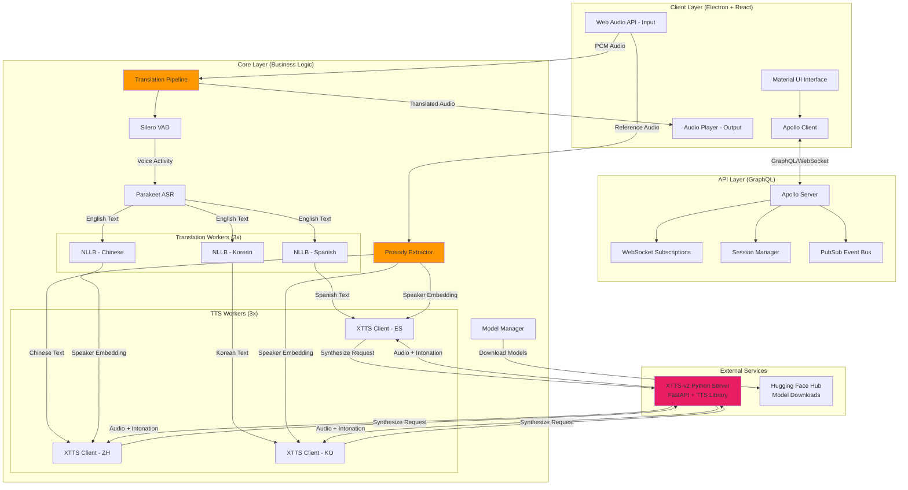

### Component Interaction Sequence

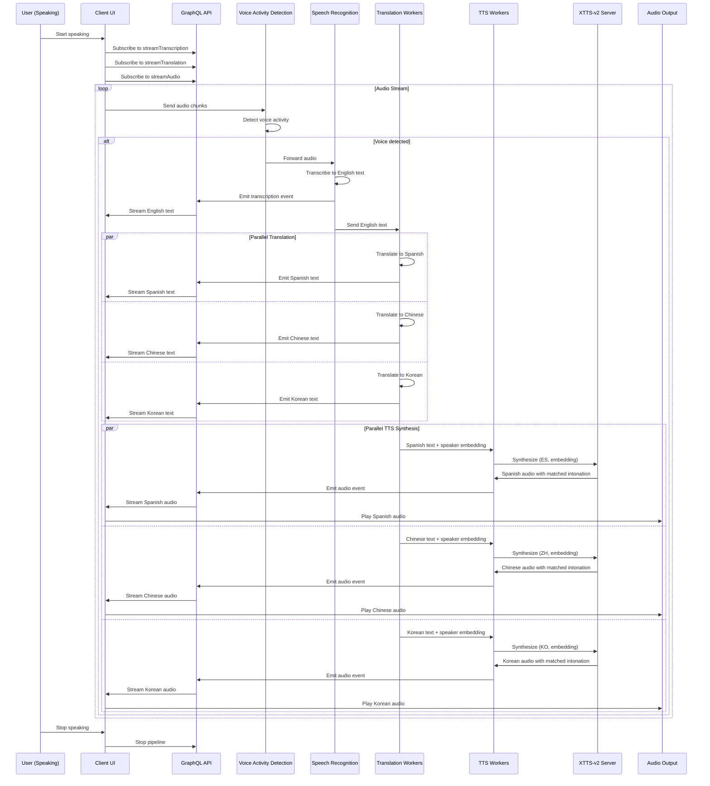

### Data Flow: Voice Input to Translated Output

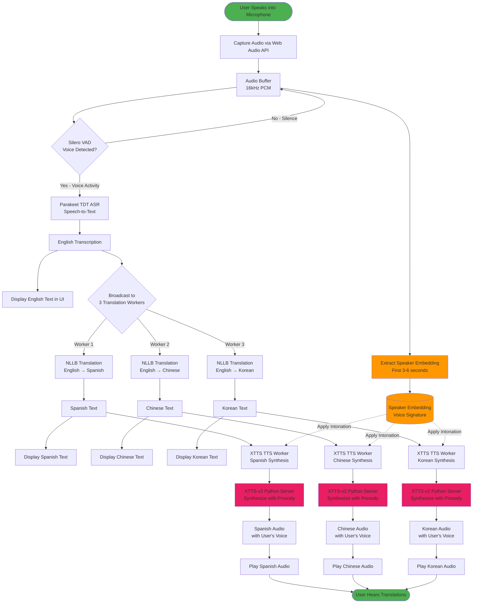

### Pipeline State Machine

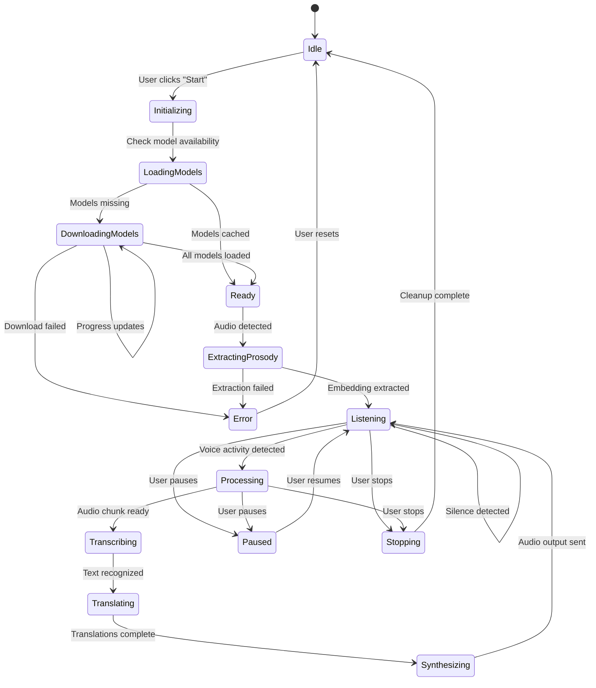

### Translation Pipeline Activity Diagram

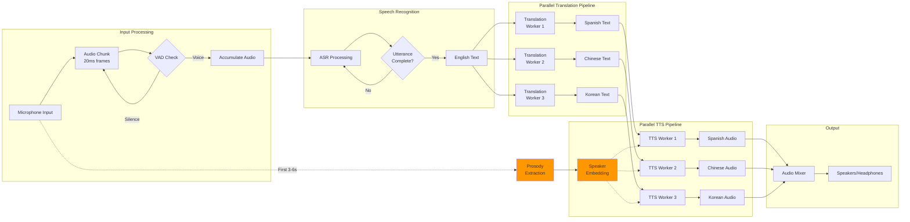

### Web Worker Architecture

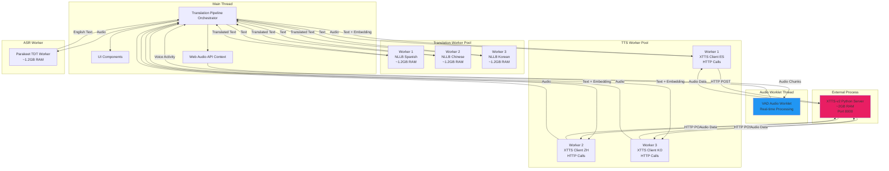

### Memory Allocation Diagram

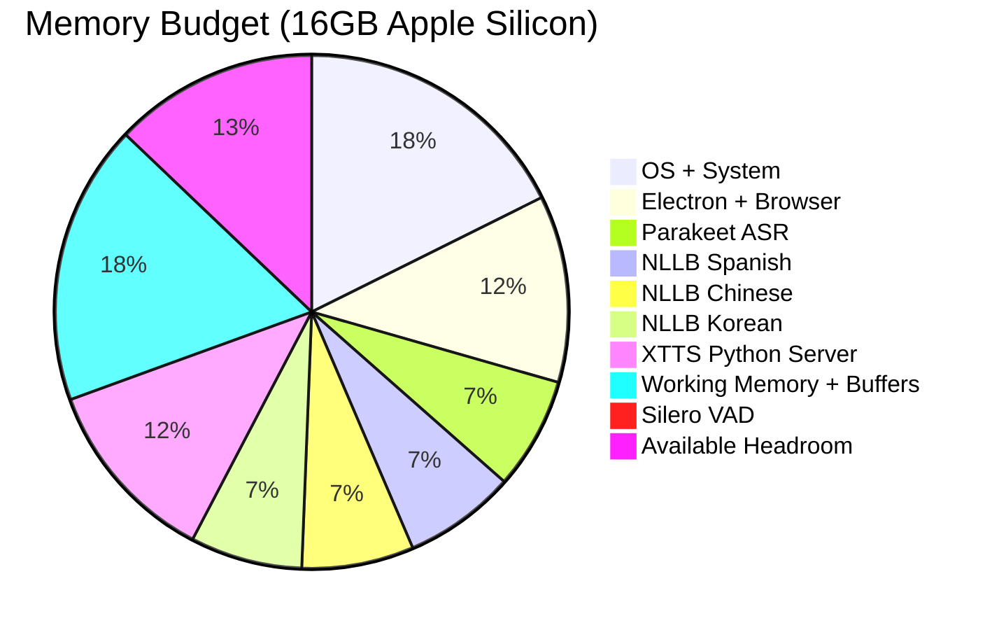

### GraphQL Subscription Flow

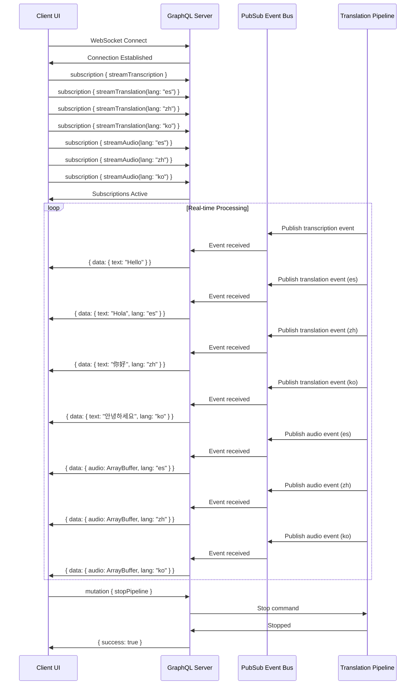

### Voice Intonation Matching Process (Primary Differentiator)

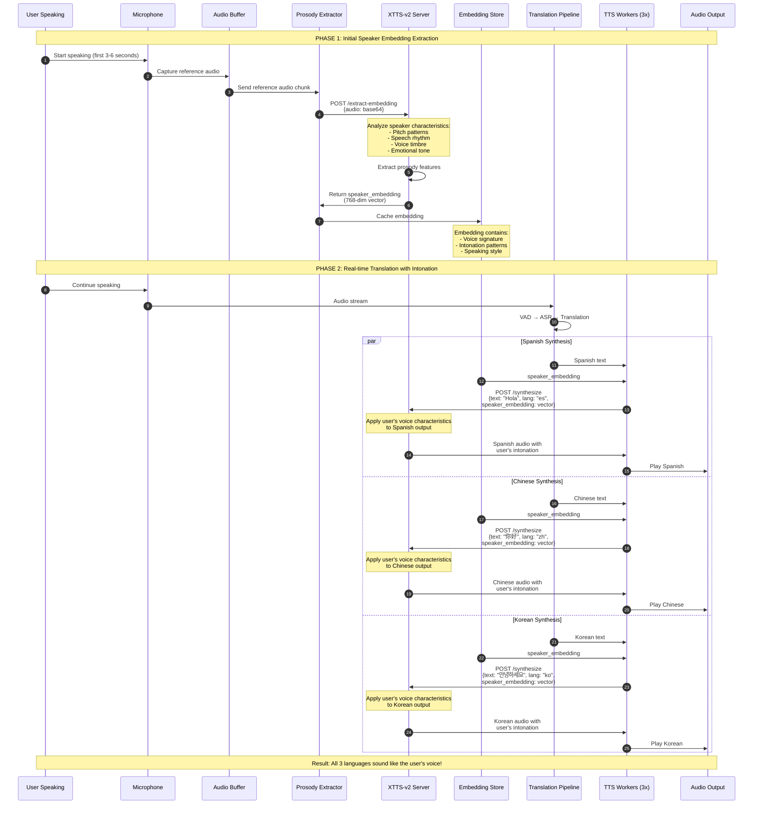

### XTTS-v2 Python Service Architecture


### Complete End-to-End Data Transformation

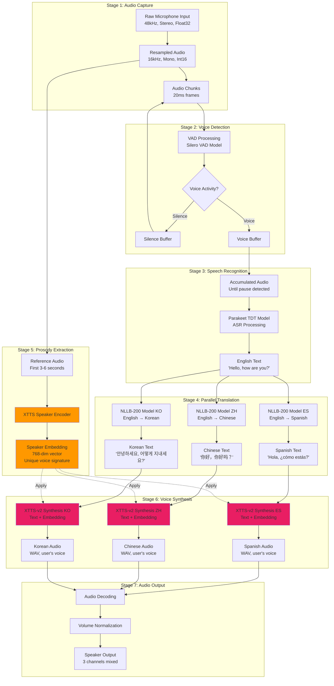

### Three-Layer Design (Revised: Client-Server Separation)

**projects/server** (Translation Server - The Workhorse)

Combines Core + API into a standalone server process that can run independently:

- ASR, Translation, TTS, VAD service implementations
- TranslationPipeline orchestration
- Web Worker architecture for parallelism
- Model management (on-demand downloads)
- Audio processing utilities
- GraphQL API with WebSocket subscriptions
- Session management for multi-client support
- Can run locally or on remote machine
- Accepts audio input (live stream or file upload)
- Produces audio output (live stream or file download)

**projects/client-app** (Configuration & Control UI)

Lightweight Electron + React application focused on configuration:

- **Model Configuration UI**: Select ASR, Translation, TTS models
- **Session Configuration UI**:
  - Input settings (live audio via audio jack OR file upload MP3/WAV)
  - Language settings (enable/disable Spanish, Chinese, Korean)
  - Output settings (live stream OR save to file)
- **Server Connection**: Connect to local or remote server
- **Session Control**: Start/stop translation sessions
- **Real-time Monitoring**: Display transcription, translations, and status
- Apollo Client for GraphQL communication
- No heavy ML processing (all done server-side)

### Deployment Architecture (Revised: Client-Server Model)

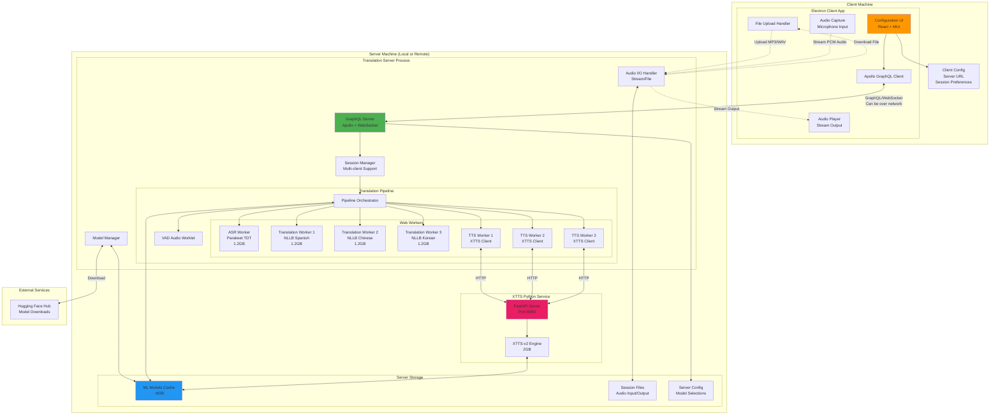

**Deployment Scenarios:**

1. **Local Deployment** (Development/Single User):

   - Client and Server both run on same machine (localhost)
   - Low latency, full resource access

2. **Remote Deployment** (Production/Multi-User):

   - Server runs on powerful machine/cloud instance (16GB+ RAM)
   - Multiple thin clients connect remotely
   - Clients only need network connection, no heavy GPU/RAM

3. **Hybrid Deployment**:
   - Server on local network (e.g., Mac Studio with 64GB RAM)
   - Multiple users connect via LAN
   - Low latency + resource sharing

````

### UI Component Hierarchy (Revised: Configuration-Focused Client)

```mermaid
graph TB
    subgraph "Client Application UI"
        App[App.tsx<br/>Apollo Provider + Theme + Router]

        App --> Layout[MainLayout.tsx<br/>MUI Container]

        Layout --> Header[Header.tsx<br/>App Title + Server Connection]
        Layout --> Main[MainContent.tsx<br/>Tabbed Layout]

        Main --> ConfigTab[Configuration Tab]
        Main --> SessionTab[Session Tab]
        Main --> MonitorTab[Monitor Tab]

        subgraph "Configuration Tab Components"
            ConfigTab --> ServerConfig[ServerConnectionConfig.tsx<br/>Server URL, Connection Status]
            ConfigTab --> ModelConfig[ModelSelectionConfig.tsx<br/>ASR/Translation/TTS Model Picker]
            ConfigTab --> SaveConfig[SaveConfigButton.tsx<br/>Persist to Server]
        end

        subgraph "Session Tab Components"
            SessionTab --> SessionForm[SessionConfigForm.tsx]

            SessionForm --> InputConfig[InputSourceConfig.tsx]
            SessionForm --> LangConfig[LanguageConfig.tsx]
            SessionForm --> OutputConfig[OutputDestinationConfig.tsx]
            SessionForm --> StartSession[StartSessionButton.tsx]

            InputConfig --> LiveAudioInput[LiveAudioInput.tsx<br/>Mic Selection]
            InputConfig --> FileInput[FileInput.tsx<br/>Upload MP3/WAV]

            LangConfig --> SourceLang[SourceLanguage.tsx<br/>Default: English]
            LangConfig --> TargetLangs[TargetLanguages.tsx<br/>Enable ES/ZH/KO]

            OutputConfig --> LiveStream[LiveStreamOutput.tsx<br/>Play in Browser]
            OutputConfig --> FileOutput[FileOutput.tsx<br/>Save to File]
        end

        subgraph "Monitor Tab Components"
            MonitorTab --> SessionList[ActiveSessionsList.tsx<br/>Running Sessions]
            MonitorTab --> Display[TranslationDisplay.tsx<br/>Real-time Results]

            Display --> SourcePanel[SourceTranscription.tsx<br/>English Text Display]
            Display --> TargetPanels[TargetLanguagePanels.tsx<br/>3-Column Layout]

            TargetPanels --> SpanishPanel[SpanishPanel.tsx<br/>Text + Audio Waveform]
            TargetPanels --> ChinesePanel[ChinesePanel.tsx<br/>Text + Audio Waveform]
            TargetPanels --> KoreanPanel[KoreanPanel.tsx<br/>Text + Audio Waveform]

            Display --> AudioPlayer[AudioPlayer.tsx<br/>Playback Controls]
        end

        Layout --> Footer[Footer.tsx<br/>Status Bar]

        Footer --> ConnStatus[ConnectionStatus.tsx<br/>Server Online/Offline]
        Footer --> SessionStatus[SessionStatus.tsx<br/>Active/Idle]
        Footer --> ServerStats[ServerStats.tsx<br/>Server RAM/CPU]
    end

    subgraph "GraphQL Operations"
        Queries[Queries:<br/>- serverInfo<br/>- availableModels<br/>- sessionStatus]
        Mutations[Mutations:<br/>- updateServerConfig<br/>- createSession<br/>- stopSession<br/>- uploadAudioFile]
        Subscriptions[Subscriptions:<br/>- streamTranscription<br/>- streamTranslation<br/>- streamAudio<br/>- sessionStatus]
    end

    ServerConfig -.->|Query| Queries
    ModelConfig -.->|Query| Queries
    ModelConfig -.->|Mutate| Mutations

    SessionForm -.->|Mutate| Mutations
    FileInput -.->|Upload| Mutations

    Display -.->|Subscribe| Subscriptions
    SessionStatus -.->|Subscribe| Subscriptions
    ServerStats -.->|Subscribe| Subscriptions

    style ConfigTab fill:#ff9800
    style SessionTab fill:#2196f3
    style MonitorTab fill:#4caf50
````

### Session Configuration Flow

```mermaid
sequenceDiagram
    participant User
    participant UI as Client UI
    participant Server as Translation Server

    Note over User,Server: Step 1: Configure Server & Models

    User->>UI: Open Configuration Tab
    UI->>Server: Query availableModels()
    Server->>UI: Return model list
    User->>UI: Select ASR, Translation, TTS models
    User->>UI: Click "Save Configuration"
    UI->>Server: Mutation updateServerConfig(models)
    Server->>UI: Configuration saved ✓

    Note over User,Server: Step 2: Configure Session

    User->>UI: Open Session Tab
    User->>UI: Select Input Source

    alt Live Audio Input
        User->>UI: Select microphone device
        UI->>UI: Enable audio capture
    else File Input
        User->>UI: Upload MP3/WAV file
        UI->>Server: Mutation uploadAudioFile(file)
        Server->>UI: File uploaded, ID returned
    end

    User->>UI: Enable target languages (ES, ZH, KO)

    User->>UI: Select Output Destination
    alt Live Stream
        UI->>UI: Prepare audio player
    else Save to File
        UI->>UI: Prepare download handler
    end

    Note over User,Server: Step 3: Start Translation Session

    User->>UI: Click "Start Session"
    UI->>Server: Mutation createSession({<br/>  input: {type, source},<br/>  languages: ["es", "zh", "ko"],<br/>  output: {type, destination}<br/>})
    Server->>Server: Initialize pipeline
    Server->>UI: Session created, ID returned

    UI->>Server: Subscribe to streamTranscription(sessionId)
    UI->>Server: Subscribe to streamTranslation(sessionId, lang)
    UI->>Server: Subscribe to streamAudio(sessionId, lang)

    Note over User,Server: Step 4: Monitor Results

    User->>UI: Switch to Monitor Tab

    loop Real-time Translation
        Server->>UI: Stream transcription updates
        Server->>UI: Stream translation updates
        Server->>UI: Stream audio data
        UI->>User: Display text & play audio
    end

    Note over User,Server: Step 5: Stop Session

    User->>UI: Click "Stop Session"
    UI->>Server: Mutation stopSession(sessionId)
    Server->>Server: Cleanup pipeline

    alt Output to File
        Server->>UI: Download link ready
        UI->>User: Prompt file download
    end

    Server->>UI: Session stopped ✓
```

### Audio Streaming Architecture

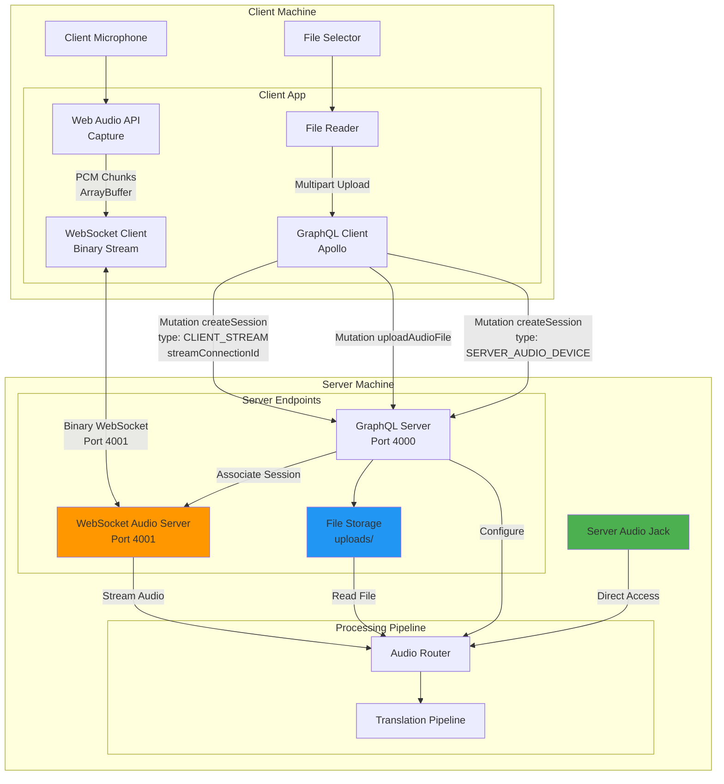

### Audio Source Handling Details

#### **1. Server Audio Device (Lowest Latency)**

```typescript
// Client UI Configuration
const sessionInput = {
  inputSource: {
    type: 'SERVER_AUDIO_DEVICE',
    deviceId: 'default' // or specific device ID from server
  },
  languages: { source: 'EN', targets: ['ES', 'ZH', 'KO'] },
  outputDestination: { type: 'LIVE_STREAM' }
};

// Client sends GraphQL mutation
mutation CreateSession($input: SessionInput!) {
  createSession(input: $input) { id status }
}

// Server directly accesses audio device
const stream = await navigator.mediaDevices.getUserMedia({ audio: true });
// No network transmission - server processes locally
```

#### **2. File Upload (GraphQL Multipart Request)**

```typescript
// Client: Select file and upload
const file = document.getElementById("audioFile").files[0];

// Upload via GraphQL multipart request
const { data } = await apolloClient.mutate({
  mutation: UPLOAD_AUDIO_FILE,
  variables: { file },
  context: {
    fetchOptions: {
      useUpload: true, // graphql-upload
    },
  },
});

const fileId = data.uploadAudioFile.id;

// Create session referencing uploaded file
const sessionInput = {
  inputSource: {
    type: "FILE",
    fileId: fileId,
  },
  languages: { source: "EN", targets: ["ES", "ZH", "KO"] },
  outputDestination: { type: "FILE", format: "MP3" },
};
```

**Server Implementation:**

```typescript
// Apollo Server with graphql-upload
import { GraphQLUpload } from "graphql-upload";

const resolvers = {
  Upload: GraphQLUpload,

  Mutation: {
    uploadAudioFile: async (_, { file }) => {
      const { createReadStream, filename, mimetype } = await file;
      const stream = createReadStream();

      // Save to disk
      const filePath = path.join("uploads", `${uuid()}-${filename}`);
      await pipeline(stream, fs.createWriteStream(filePath));

      // Analyze file (duration, format)
      const metadata = await analyzeAudio(filePath);

      return {
        id: uuid(),
        fileName: filename,
        size: metadata.size,
        duration: metadata.duration,
        format: metadata.format,
      };
    },
  },
};
```

#### **3. Client Stream (WebRTC DataChannel - Lowest Latency)**

**Client Implementation:**

```typescript
// Step 1: Create WebRTC peer connection
const pc = new RTCPeerConnection({
  iceServers: [{ urls: "stun:stun.l.google.com:19302" }],
});

const streamConnectionId = uuid();

// Step 2: Create data channel for audio streaming
const audioChannel = pc.createDataChannel("audio-stream", {
  ordered: false, // Allow out-of-order delivery for lower latency
  maxRetransmits: 0, // Don't retransmit lost packets (real-time priority)
});

// Step 3: Capture and send audio
const audioContext = new AudioContext({ sampleRate: 16000 });
const stream = await navigator.mediaDevices.getUserMedia({ audio: true });
const source = audioContext.createMediaStreamSource(stream);

// Use AudioWorklet for better performance (replaces ScriptProcessor)
await audioContext.audioWorklet.addModule("/audio-processor.js");
const workletNode = new AudioWorkletNode(
  audioContext,
  "audio-stream-processor"
);

workletNode.port.onmessage = (event) => {
  const { audioData } = event.data;

  // Send PCM audio via WebRTC DataChannel (binary)
  if (audioChannel.readyState === "open") {
    audioChannel.send(audioData.buffer);
  }
};

source.connect(workletNode);
workletNode.connect(audioContext.destination);

// Step 4: WebRTC signaling via GraphQL
audioChannel.onopen = () => {
  console.log("Audio channel opened");
};

// Create offer
const offer = await pc.createOffer();
await pc.setLocalDescription(offer);

// Wait for ICE gathering
await new Promise((resolve) => {
  if (pc.iceGatheringState === "complete") {
    resolve();
  } else {
    pc.addEventListener("icegatheringstatechange", () => {
      if (pc.iceGatheringState === "complete") resolve();
    });
  }
});

// Send offer to server via GraphQL
const { data } = await apolloClient.mutate({
  mutation: INITIATE_WEBRTC_SESSION,
  variables: {
    streamConnectionId,
    offer: pc.localDescription,
  },
});

// Receive answer from server
const answer = new RTCSessionDescription(data.initiateWebRTCSession.answer);
await pc.setRemoteDescription(answer);

// Step 5: Create session via GraphQL
const sessionInput = {
  inputSource: {
    type: "CLIENT_STREAM",
    streamConnectionId: streamConnectionId,
  },
  languages: { source: "EN", targets: ["ES", "ZH", "KO"] },
  outputDestination: { type: "LIVE_STREAM" },
};

await apolloClient.mutate({
  mutation: CREATE_SESSION,
  variables: { input: sessionInput },
});
```

**AudioWorklet Processor (audio-processor.js):**

```javascript
// Runs in audio worklet thread for low-latency processing
class AudioStreamProcessor extends AudioWorkletProcessor {
  constructor() {
    super();
    this.bufferSize = 4096;
    this.buffer = new Float32Array(this.bufferSize);
    this.bufferIndex = 0;
  }

  process(inputs, outputs, parameters) {
    const input = inputs[0];
    if (!input || !input[0]) return true;

    const channelData = input[0];

    for (let i = 0; i < channelData.length; i++) {
      this.buffer[this.bufferIndex++] = channelData[i];

      if (this.bufferIndex >= this.bufferSize) {
        // Convert Float32 to Int16 PCM
        const int16Array = new Int16Array(this.bufferSize);
        for (let j = 0; j < this.bufferSize; j++) {
          const s = Math.max(-1, Math.min(1, this.buffer[j]));
          int16Array[j] = s < 0 ? s * 0x8000 : s * 0x7fff;
        }

        // Send to main thread
        this.port.postMessage({ audioData: int16Array });

        // Reset buffer
        this.bufferIndex = 0;
      }
    }

    return true;
  }
}

registerProcessor("audio-stream-processor", AudioStreamProcessor);
```

**Server Implementation:**

```typescript
import { RTCPeerConnection, RTCSessionDescription } from "wrtc"; // Node.js WebRTC

const activeConnections = new Map(); // streamConnectionId -> peer connection

// GraphQL resolver for WebRTC signaling
const resolvers = {
  Mutation: {
    initiateWebRTCSession: async (_, { streamConnectionId, offer }) => {
      // Create peer connection on server
      const pc = new RTCPeerConnection({
        iceServers: [{ urls: "stun:stun.l.google.com:19302" }],
      });

      // Handle incoming data channel
      pc.ondatachannel = (event) => {
        const dataChannel = event.channel;

        dataChannel.onopen = () => {
          console.log(`Audio channel opened for ${streamConnectionId}`);
        };

        dataChannel.onmessage = (event) => {
          // Receive binary PCM audio data
          const audioData = new Int16Array(event.data);

          // Route to translation pipeline
          emitAudioChunk(streamConnectionId, audioData);
        };

        dataChannel.onerror = (error) => {
          console.error("DataChannel error:", error);
        };
      };

      // Set remote description (client's offer)
      await pc.setRemoteDescription(new RTCSessionDescription(offer));

      // Create answer
      const answer = await pc.createAnswer();
      await pc.setLocalDescription(answer);

      // Store connection
      activeConnections.set(streamConnectionId, pc);

      return {
        streamConnectionId,
        answer: pc.localDescription,
      };
    },

    stopWebRTCSession: async (_, { streamConnectionId }) => {
      const pc = activeConnections.get(streamConnectionId);
      if (pc) {
        pc.close();
        activeConnections.delete(streamConnectionId);
      }
      return true;
    },
  },
};
```

**GraphQL Schema Addition:**

```graphql
type Mutation {
  # ... existing mutations ...

  # WebRTC signaling
  initiateWebRTCSession(
    streamConnectionId: ID!
    offer: RTCSessionDescriptionInput!
  ): WebRTCSessionResponse!

  stopWebRTCSession(streamConnectionId: ID!): Boolean!
}

input RTCSessionDescriptionInput {
  type: String! # "offer" or "answer"
  sdp: String! # Session Description Protocol
}

type WebRTCSessionResponse {
  streamConnectionId: ID!
  answer: RTCSessionDescription!
}

type RTCSessionDescription {
  type: String!
  sdp: String!
}
```

#### **4. File Path (Server-Accessible - Ideal for Testing)**

```typescript
// Client UI Configuration
const sessionInput = {
  inputSource: {
    type: "FILE_PATH",
    filePath: "/Users/tangent/test-audio/sample.wav",
    // Or network path: '/mnt/shared/audio/sample.mp3'
  },
  languages: { source: "EN", targets: ["ES", "ZH", "KO"] },
  outputDestination: { type: "FILE", format: "MP3" },
};

// Client sends GraphQL mutation
await apolloClient.mutate({
  mutation: CREATE_SESSION,
  variables: { input: sessionInput },
});
```

**Server Implementation:**

```typescript
const resolvers = {
  Mutation: {
    createSession: async (_, { input }) => {
      if (input.inputSource.type === "FILE_PATH") {
        const { filePath } = input.inputSource;

        // Validate file exists and is accessible
        if (!fs.existsSync(filePath)) {
          throw new Error(`File not found: ${filePath}`);
        }

        // Security check: prevent path traversal attacks
        const resolvedPath = path.resolve(filePath);
        const allowedPaths = [
          "/Users/tangent/test-audio",
          "/mnt/shared/audio",
          process.env.AUDIO_FILES_DIR,
        ].filter(Boolean);

        const isAllowed = allowedPaths.some((allowed) =>
          resolvedPath.startsWith(path.resolve(allowed))
        );

        if (!isAllowed) {
          throw new Error("File path not in allowed directories");
        }

        // Read file directly (no upload needed)
        const audioStream = fs.createReadStream(resolvedPath);

        // Route to translation pipeline
        return await processAudioFile(audioStream, input);
      }
    },
  },
};
```

**Use Cases:**

- **Local Development**: Client and server on same machine, point to local files
- **Shared Filesystem**: Server mounted to NFS/SMB, client references network paths
- **Testing**: Quick iteration without upload overhead
- **Batch Processing**: Process multiple files from a watched directory

**Benefits:**

- No file upload latency
- No duplicate storage (file exists only once)
- Simpler client code (just pass path string)
- Efficient for large files

**Security Considerations:**

- Whitelist allowed directories to prevent arbitrary file access
- Validate paths to prevent directory traversal (`../../etc/passwd`)
- Consider file permissions (server process must have read access)

````

### Protocol Comparison

| Aspect | Server Device | File Upload | File Path | Client Stream |
|--------|--------------|-------------|-----------|---------------|
| **Latency** | Lowest (~10ms) | N/A (batch) | N/A (batch) | Medium (~50-100ms) |
| **Network Usage** | None | One-time upload | None | Continuous (~64kbps) |
| **Use Case** | Server has mic | Remote file processing | Local/shared filesystem | Remote real-time |
| **GraphQL Role** | Session config only | Upload + session config | Session config only | Signaling + session config |
| **Transport** | Local device access | HTTP Multipart | Local filesystem | WebRTC DataChannel |
| **Complexity** | Low | Low | Low | Medium-High |
| **Best For** | Local setup | Remote clients | Testing/development | Production real-time |

### GraphQL Schema (Revised for Client-Server Model)

```graphql
# ============================================
# Server Configuration
# ============================================

type ServerInfo {
  version: String!
  status: ServerStatus!
  capabilities: ServerCapabilities!
  resources: ResourceUsage!
}

type ServerStatus {
  online: Boolean!
  modelsLoaded: Boolean!
  activeSessionsCount: Int!
}

type ServerCapabilities {
  supportedLanguages: [Language!]!
  availableModels: ModelCatalog!
  maxConcurrentSessions: Int!
}

type ModelCatalog {
  asr: [ModelInfo!]!
  translation: [ModelInfo!]!
  tts: [ModelInfo!]!
  vad: [ModelInfo!]!
}

type ModelInfo {
  id: ID!
  name: String!
  size: String!
  downloaded: Boolean!
  loaded: Boolean!
}

type ResourceUsage {
  memoryUsed: Float!
  memoryTotal: Float!
  cpuPercent: Float!
}

enum Language {
  EN
  ES
  ZH
  KO
}

# ============================================
# Session Configuration
# ============================================

input SessionInput {
  inputSource: InputSourceConfig!
  languages: LanguageConfig!
  outputDestination: OutputDestinationConfig!
}

input InputSourceConfig {
  type: InputType!
  fileId: ID                    # For FILE_UPLOAD type
  deviceId: String              # For SERVER_AUDIO_DEVICE type
  streamConnectionId: String    # For CLIENT_STREAM type
  filePath: String              # For FILE_PATH type (server-accessible path)
}

enum InputType {
  SERVER_AUDIO_DEVICE  # Audio jack directly on server
  FILE_UPLOAD          # Client uploads MP3/WAV via GraphQL multipart
  FILE_PATH            # Server reads from accessible file path (local/network)
  CLIENT_STREAM        # Real-time audio from client's microphone
}

input LanguageConfig {
  source: Language!
  targets: [Language!]!
}

input OutputDestinationConfig {
  type: OutputType!
  format: AudioFormat
}

enum OutputType {
  LIVE_STREAM
  FILE
}

enum AudioFormat {
  WAV
  MP3
  FLAC
}

# ============================================
# Session Management
# ============================================

type Session {
  id: ID!
  status: SessionStatus!
  config: SessionConfig!
  createdAt: String!
  startedAt: String
  completedAt: String
  outputFileUrl: String
}

type SessionConfig {
  inputSource: InputSourceInfo!
  languages: LanguageConfig!
  outputDestination: OutputDestinationInfo!
}

type InputSourceInfo {
  type: InputType!
  fileName: String
  duration: Float
}

type OutputDestinationInfo {
  type: OutputType!
  format: AudioFormat
}

enum SessionStatus {
  CREATED
  INITIALIZING
  EXTRACTING_PROSODY
  RUNNING
  PAUSED
  COMPLETING
  COMPLETED
  ERROR
}

# ============================================
# Real-time Streaming Data
# ============================================

type TranscriptionUpdate {
  sessionId: ID!
  timestamp: Float!
  text: String!
  isFinal: Boolean!
}

type TranslationUpdate {
  sessionId: ID!
  language: Language!
  timestamp: Float!
  text: String!
}

type AudioChunk {
  sessionId: ID!
  language: Language!
  timestamp: Float!
  audio: String!      # Base64 encoded audio data
  format: AudioFormat!
}

type SessionStatusUpdate {
  sessionId: ID!
  status: SessionStatus!
  progress: Float
  message: String
}

# ============================================
# Queries
# ============================================

type Query {
  # Server information
  serverInfo: ServerInfo!

  # Model management
  availableModels: ModelCatalog!
  modelInfo(id: ID!): ModelInfo

  # Session queries
  session(id: ID!): Session
  activeSessions: [Session!]!
  sessionHistory(limit: Int = 10): [Session!]!
}

# ============================================
# Mutations
# ============================================

type Mutation {
  # Server configuration
  updateServerConfig(models: ModelSelectionInput!): ServerInfo!
  downloadModel(modelId: ID!): ModelDownloadJob!

  # File upload
  uploadAudioFile(file: Upload!): AudioFile!

  # Session management
  createSession(input: SessionInput!): Session!
  startSession(id: ID!): Session!
  pauseSession(id: ID!): Session!
  resumeSession(id: ID!): Session!
  stopSession(id: ID!): Session!
  deleteSession(id: ID!): Boolean!
}

input ModelSelectionInput {
  asr: ID
  translation: ID
  tts: ID
  vad: ID
}

type ModelDownloadJob {
  modelId: ID!
  progress: Float!
  status: DownloadStatus!
}

enum DownloadStatus {
  QUEUED
  DOWNLOADING
  COMPLETED
  FAILED
}

type AudioFile {
  id: ID!
  fileName: String!
  size: Int!
  duration: Float!
  format: AudioFormat!
}

scalar Upload

# ============================================
# Subscriptions
# ============================================

type Subscription {
  # Real-time translation streaming
  streamTranscription(sessionId: ID!): TranscriptionUpdate!
  streamTranslation(sessionId: ID!, language: Language!): TranslationUpdate!
  streamAudio(sessionId: ID!, language: Language!): AudioChunk!

  # Session status updates
  sessionStatus(sessionId: ID!): SessionStatusUpdate!

  # Server monitoring
  serverStats: ResourceUsage!

  # Model download progress
  modelDownloadProgress(modelId: ID!): ModelDownloadJob!
}
````

### Model Loading & Caching Flow

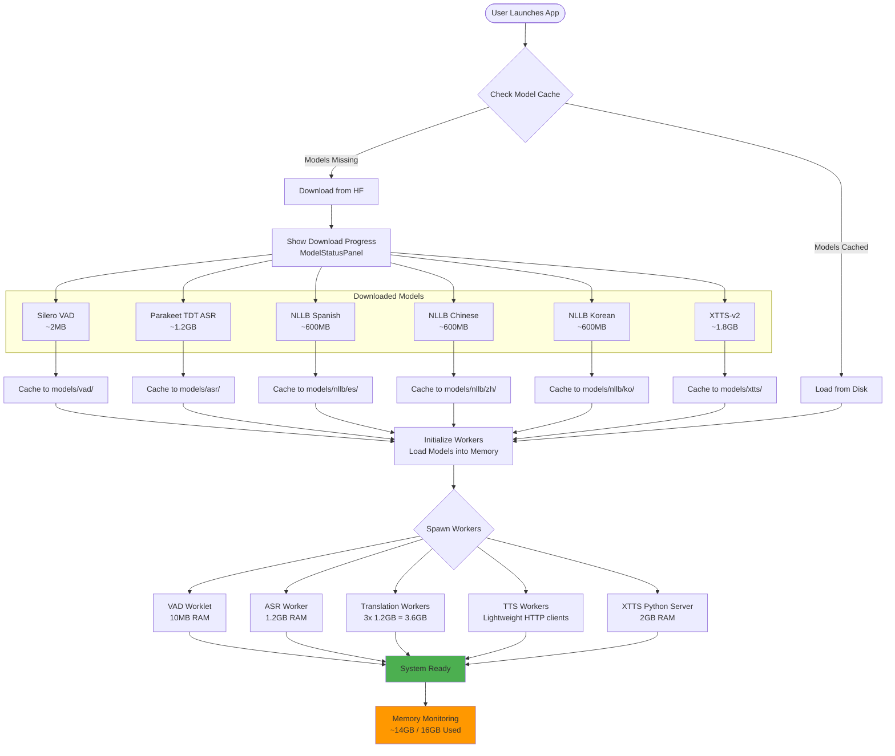

### Error Handling & Recovery Flow

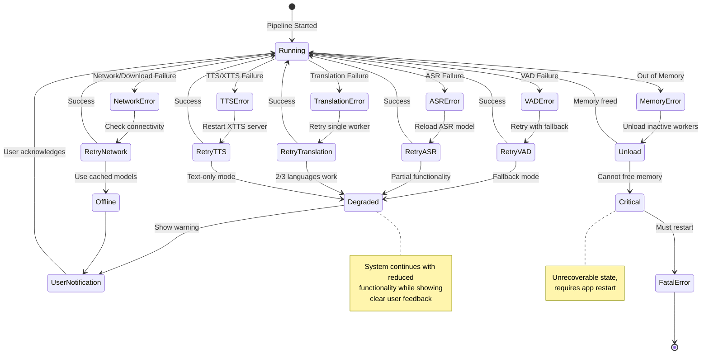

### Key Technical Decisions

1. **Client-Server Architecture**: Server handles all ML processing, client focuses on configuration and monitoring. Enables remote deployment and multi-client scenarios.
2. **Session-Based Processing**: Each translation task is a configurable session with input source (live/file), target languages, and output destination (stream/file).
3. **XTTS-v2 as Python Microservice**: No mature TypeScript implementation exists; Python backend with HTTP API required for prosody extraction.
4. **NLLB-200 Distilled (600M)**: Fits 3 instances in memory (~3.6GB total).
5. **Web Workers for Parallelism**: 3 translation workers + 3 TTS workers for simultaneous language processing (server-side).
6. **GraphQL Subscriptions**: Standard protocol for multi-client real-time streaming over network.
7. **On-Demand Model Downloads**: Transformers.js auto-download, cached in server's `models/` directory.
8. **Flexible I/O**: Support both live audio streaming and file-based processing for maximum versatility.

### Benefits of Client-Server Architecture

**Scalability:**

- Single powerful server (64GB RAM) can serve multiple lightweight clients
- Easy horizontal scaling by adding more server instances
- Clients require minimal resources (no GPU, minimal RAM)

**Flexibility:**

- Server can run locally (localhost) for development/personal use
- Server can run on remote machine/cloud for production
- Server can run on LAN for team collaboration
- Mix and match: different users can use different input/output modes simultaneously

**Separation of Concerns:**

- **Client**: Configuration UI, session management, monitoring

  - Easy to update UI without touching ML code
  - Can build web client, mobile client, CLI client
  - Minimal dependencies (React, Apollo Client)

- **Server**: ML processing, model management, pipeline orchestration
  - Focus on performance and accuracy
  - Independent testing and optimization
  - Can upgrade models without client changes

**Development Workflow:**

- Frontend developers work on client without needing ML expertise
- ML engineers work on server without touching UI code
- Independent deployment and versioning
- Easier testing (mock server for client tests, mock client for server tests)

**Use Cases Enabled:**

1. **Personal Use**: Client + Server on laptop (localhost)
2. **Team Use**: Server on Mac Studio, multiple team members connect via LAN
3. **Cloud Deployment**: Server on AWS/GCP, clients anywhere with internet
4. **Batch Processing**: Upload files via client, server processes overnight, download results
5. **Multi-Session**: One user runs live translation while another processes files

## Implementation Roadmap

### Phase 1: Foundation & Core Abstractions (Week 1)

**Environment Setup with ASDF**

- Install ASDF version manager: <https://asdf-vm.com/guide/getting-started.html>
- Create `.tool-versions` file in repository root:

  ```text
  nodejs 20.11.1
  python 3.11.8
  poetry 1.8.2
  pnpm 10.7.0
  ```

- Install ASDF plugins:

  ```bash
  asdf plugin add nodejs https://github.com/asdf-vm/asdf-nodejs.git
  asdf plugin add python https://github.com/asdf-community/asdf-python.git
  asdf plugin add poetry https://github.com/asdf-community/asdf-poetry.git
  asdf plugin add pnpm https://github.com/jonathanmorley/asdf-pnpm.git
  ```

- Bootstrap environment: `asdf install` (reads `.tool-versions` and installs all runtimes)
- Verify installations:

  ```bash
  node --version    # 20.11.1
  python --version  # 3.11.8
  poetry --version  # 1.8.2
  pnpm --version    # 10.7.0
  ```

**Setup TypeScript & Dependencies**

- Create `tsconfig.base.json` and per-package configs (strict mode enabled)
- Update `package.json` files with dependencies
- Run `pnpm install` across monorepo

**Core Interfaces** (`projects/core/src/interfaces/`)

- `IASR.ts` - ASR abstraction with streaming support
- `ITranslator.ts` - Translation abstraction for NLLB-200
- `ITTS.ts` - TTS abstraction with speaker embedding support (critical for XTTS-v2)
- `IVAD.ts` - Voice activity detection interface
- `IModelManager.ts` - Model download and caching interface

**ModelManager Implementation**

- `ModelRegistry.ts` - Metadata for Parakeet TDT, NLLB-200, XTTS-v2, Silero VAD
- `ModelManager.ts` - On-demand download via Transformers.js, cache management
- Test with small model (Silero VAD ~2MB)

**Deliverables**: Compilable Core package, working model download system, first boundary tests

### Phase 2: ASR + VAD (Week 2)

**Voice Activity Detection**

- Implement `SileroVAD.ts` using `@ricky0123/vad-web`
- AudioWorklet integration for browser context
- Test with audio fixtures (silence vs speech)

**Speech Recognition**

- Implement `ParakeetASR.ts` using Transformers.js
- Streaming transcription with partial/final results
- Handle 16kHz audio resampling

**Audio Utilities** (`projects/core/src/audio/`)

- `AudioBuffer.ts` - Circular buffer for streaming
- `AudioConverter.ts` - WAV/MP3 format conversion
- `AudioResampler.ts` - Resample to 16kHz for ASR

**Deliverables**: Working VAD and ASR with boundary tests, audio processing pipeline

### Phase 3: Translation with Web Workers (Week 3)

**NLLB Translator**

- Implement `NLLBTranslator.ts` for English → Spanish/Chinese/Korean
- Single-shot translation first, then streaming

**Web Worker Architecture**

- `translation.worker.ts` - Isolated NLLB instance per language
- `worker-pool.ts` - Manage 3 parallel workers with task queuing
- Use Comlink for simplified message passing

**Memory Profiling**

- Load 3 NLLB instances simultaneously
- Verify memory usage <4GB for translations

**Deliverables**: Parallel translation for 3 languages, memory benchmarks

### Phase 4: XTTS-v2 Intonation Matching (Week 4) **[PRIMARY DIFFERENTIATOR]**

**Python Backend Setup**

- Create `xtts-server/` with FastAPI service
- Endpoints: `/extract-embedding`, `/synthesize`, `/health`
- Use TTS library for XTTS-v2 prosody extraction

**TypeScript Client**

- Implement `XTTSSTTS.ts` - HTTP client to Python backend
- `ProsodyExtractor.ts` - Helper for speaker embedding management
- Extract embedding from first 3-6 seconds of reference audio

**Intonation Matching Flow**

1. User speaks (English audio captured)
2. Extract speaker embedding from reference audio
3. Store embedding in pipeline context
4. Pass embedding to all TTS synthesis calls
5. Verify prosody preservation across Spanish/Chinese/Korean output

**TTS Worker Pool**

- `tts.worker.ts` - Calls XTTS API
- 3 workers for parallel synthesis

**Deliverables**: Working intonation matching, demo showing voice preservation

### Phase 5: Pipeline Orchestration (Week 5)

**TranslationPipeline**

- Orchestrate VAD → ASR → Translation (3 langs) → TTS (3 langs)
- Manage worker lifecycle and error handling
- Async generator architecture for streaming

**PipelineContext**

- Shared state: speaker embedding, session config, active languages
- Event bus for status updates

**End-to-End Testing**

- Full pipeline test with real audio
- Measure latency (target: <4s end-to-end)
- Profile memory usage (target: <6GB total)

**Deliverables**: Working pipeline, performance benchmarks

### Phase 6: GraphQL API (Week 6)

**Schema Definition** (`projects/api/src/schema/schema.graphql`)

- Queries: `health`, `modelStatus`, `listModels`, `sessionInfo`
- Mutations: `startPipeline`, `stopPipeline`, `downloadModel`, `updateSpeakerEmbedding`
- Subscriptions: `streamTranscription`, `streamTranslation`, `streamAudio`, `pipelineStatus`

**Apollo Server Setup**

- Configure Express + WebSocket server with `graphql-ws`
- Implement resolvers (thin wrappers around Core services)
- Setup PubSub for subscription events

**Session Management**

- `SessionManager.ts` - Track client sessions, cleanup on disconnect
- Support multiple concurrent clients

**Deliverables**: Running GraphQL server, working subscriptions, integration tests

### Phase 7: Electron Client (Week 7-8)

**Electron Setup**

- Vite configuration for Electron build
- Main process, preload script, renderer setup

**React + MUI Components**

- `TranscriptionView` - Live English transcription display
- `TranslationView` - 3-panel layout for Spanish/Chinese/Korean
- `AudioControls` - Start/stop, volume, language selection
- `ModelStatus` - Download progress indicators

**Apollo Client Integration**

- GraphQL subscriptions for real-time updates
- State management with Zustand

**Audio I/O**

- Microphone access via Web Audio API
- AudioPlayer for TTS output (3 channels)
- AudioWorklet for VAD processing

**Deliverables**: Working Electron app with live translation UI

### Phase 8: Testing & Optimization (Week 9)

**Comprehensive Testing**

- Boundary tests for all Core modules
- API resolver integration tests
- Client component tests

**Performance Optimization**

- Profile and optimize bottlenecks
- Reduce memory footprint where possible
- Tune chunk sizes for optimal latency

**Error Handling**

- Graceful degradation on translation failures
- Retry logic for model loading
- User-friendly error messages

**Deliverables**: Production-ready code with test coverage

## Memory Budget (16GB Apple Silicon)

**Allocation Strategy**:

- OS + System: 3GB
- Electron + Browser: 2GB
- Parakeet TDT (ASR): 1.2GB
- NLLB-200 × 3 instances: 3.6GB (1.2GB each)
- XTTS-v2 (Python backend): 2GB
- Silero VAD: 10MB
- Working memory + buffers: 3GB
- **Total**: ~14GB (within 16GB limit)

**Optimizations**:

- Use quantized models if available (int8 reduces NLLB to ~400MB each)
- Lazy load/unload inactive language models
- Web Worker isolation prevents memory leaks
- Implement memory monitoring with alerts

## Critical Files to Create (Priority Order)

### Immediate - Phase 1

1. **`tsconfig.base.json`** - Root TypeScript configuration
2. **`projects/core/tsconfig.json`** - Core package TypeScript config
3. **`projects/core/package.json`** - Update with dependencies (@huggingface/transformers, onnxruntime-web, comlink)
4. **`projects/core/vite.config.ts`** - Build configuration for library mode
5. **`projects/core/src/interfaces/ITTS.ts`** - TTS interface (critical for intonation matching)
6. **`projects/core/src/interfaces/IASR.ts`** - ASR interface
7. **`projects/core/src/interfaces/ITranslator.ts`** - Translation interface
8. **`projects/core/src/interfaces/IModelManager.ts`** - Model management interface
9. **`projects/core/src/services/model-manager/ModelRegistry.ts`** - Model metadata
10. **`projects/core/src/services/model-manager/ModelManager.ts`** - Download/cache logic

### High Priority - Phase 2-3

11. **`projects/core/src/services/vad/SileroVAD.ts`** - VAD implementation
12. **`projects/core/src/services/asr/ParakeetASR.ts`** - ASR implementation
13. **`projects/core/src/services/translation/NLLBTranslator.ts`** - Translation implementation
14. **`projects/core/src/workers/translation.worker.ts`** - Web Worker for translation
15. **`projects/core/src/workers/worker-pool.ts`** - Worker pool manager

### Critical for Differentiator - Phase 4

16. **`xtts-server/main.py`** - XTTS-v2 Python backend (FastAPI)
17. **`xtts-server/requirements.txt`** - Python dependencies
18. **`projects/core/src/services/tts/XTTSSTTS.ts`** - XTTS client
19. **`projects/core/src/services/tts/ProsodyExtractor.ts`** - Speaker embedding helper

### Pipeline & API - Phase 5-6

20. **`projects/core/src/pipeline/TranslationPipeline.ts`** - Main orchestration
21. **`projects/api/src/schema/schema.graphql`** - GraphQL schema
22. **`projects/api/src/server.ts`** - Apollo Server setup
23. **`projects/api/src/resolvers/Subscription.ts`** - Streaming resolvers

### Client - Phase 7

24. **`projects/client-app/vite.config.ts`** - Electron + Vite configuration
25. **`projects/client-app/src/apollo/client.ts`** - Apollo Client setup
26. **`projects/client-app/src/components/TranslationView/TranslationView.tsx`** - Main UI

## Immediate Next Steps

To begin implementation immediately:

1. **Update package.json files** with confirmed dependencies
2. **Create TypeScript configurations** (root + per-package)
3. **Run `pnpm install`** to install all dependencies
4. **Create Core interface files** (IASR, ITranslator, ITTS, IVAD, IModelManager)
5. **Implement ModelManager** with on-demand download logic
6. **Write first boundary test** for ModelManager
7. **Verify model download** works with Silero VAD (small 2MB model)

## Summary

This plan provides a clear, actionable path to building Voice Bridge with all ambiguities resolved:

**Confirmed Decisions:**

- ✅ On-demand model downloads (not bundled)
- ✅ Multi-client GraphQL API for scalability
- ✅ All 3 languages (Spanish, Chinese, Korean) from start
- ✅ Voice intonation matching as PRIMARY goal (XTTS-v2)
- ✅ Cross-platform production, Apple Silicon primary testing
- ✅ React + TypeScript + MUI, Vite build, Silero VAD
- ✅ Boundary tests for each module

**Key Success Factors:**

1. XTTS-v2 Python backend for prosody extraction
2. Web Worker parallelism for 3 simultaneous translations
3. Memory management to stay under 16GB
4. GraphQL subscriptions for real-time streaming
5. Clean Core/API/Client separation

The project is ambitious but feasible, with XTTS-v2 intonation matching providing clear differentiation. The 8-week phased approach ensures steady progress with testable milestones.
