# Voice Bridge - Implementation Plan

## Executive Summary

**Overall Feasibility: YES - Highly Attainable**

Voice Bridge is a real-time multi-language translation system with **voice intonation matching** as the primary differentiator. The requirements are feasible and well-architected for a 2025 Node.js/React/WASM ML stack.

**Architecture: Client-Server Separation**

The system follows a **client-server model** where:

- **Server** (the workhorse): A pure Node.js process handling all heavy ML processing, model management, and translation pipeline execution. Uses `worker_threads` for parallelism. Can run locally or on remote machines.
- **Client** (configuration UI): Lightweight React web application running in a browser, focused on configuration, session management, and monitoring. Multiple clients can connect to a single server.

### Project Scope (Clarified Requirements)

**Core Features:**

1. ✅ Multi-client support via GraphQL API with subscriptions (text/control) plus binary WebSocket channels for audio
2. ✅ Three simultaneous languages: Spanish, Chinese, Korean
3. ✅ **Voice intonation matching and mimicry (XTTS-v2) - PRIMARY GOAL**
4. ✅ Streaming for text translation via GraphQL and audio output via binary WebSockets
5. ✅ On-demand model downloads (not bundled with application)
6. ✅ Multi-format audio input (WAV, MP3 via ffmpeg)
7. ✅ Decoupled architecture with model swapping capability
8. ✅ Fire-and-forget translation (languages don't block each other)

**Technology Stack (Confirmed):**

- **UI Framework**: React + TypeScript + Material UI (MUI) — **Web app in browser** (not Electron)
- **Server Runtime**: Pure Node.js with `worker_threads` for parallelism
- **Build Tool**: Vite
- **VAD**: Silero VAD
- **ASR**: Distil-Whisper Large V3 (via Transformers.js) — _Parakeet TDT not available in Transformers.js_
- **Translation**: NLLB-200-distilled-600M (via Transformers.js)
- **TTS**: XTTS-v2 with prosody embeddings for intonation matching (Python microservice)
- **API**: GraphQL (Apollo Server + Apollo Client) for control + text streams
- **Audio Streaming**: WebSocket binary in/out (audio input + per-language audio output; not WebRTC)
- **Audio Processing**: `@ffmpeg-installer/ffmpeg` + `fluent-ffmpeg`
- **Testing**: Vitest with boundary tests for each module

**Platform Targets:**

- **Primary**: Apple Silicon (16GB RAM) for testing
- **Production**: Cross-platform (macOS, Windows, Linux)

**Model Distribution Strategy:**

- On-demand downloads via Transformers.js auto-download
- Cache location: `models/` directory
- No bundling (keeps app size small, enables offline after first download)

## Current State

The repository is in **early scaffolding stage**:

- ✅ Excellent architectural foundation (pnpm monorepo, oxlint, clear README)
- ✅ Well-thought-out three-layer design (Core → API → Client)
- ❌ No TypeScript configuration
- ❌ No source code implementation
- ❌ No dependencies installed for individual projects
- ❌ No build system configured

## Architecture Overview

### System Architecture Diagram

```mermaid
graph TB
    subgraph "Client Layer (React Web App in Browser)"
        UI[Material UI Interface]
        AC[Apollo Client]
        AudioIn[Web Audio API - Input]
        AudioOut[Audio Player - Output]
    end

    subgraph "API Layer (GraphQL + Audio WS)"
        AS[Apollo Server]
        WS[WebSocket Subscriptions]
        SM[Session Manager]
        PS[PubSub Event Bus]
        AWS[Audio WebSocket<br/>(Binary In/Out)]
    end

    subgraph "Core Layer (Node.js Server with worker_threads)"
        TP[Translation Pipeline]
        VAD[Silero VAD]
        ASR[Distil-Whisper ASR]

        subgraph "Translation Workers (3x worker_threads)"
            TW1[NLLB - Spanish]
            TW2[NLLB - Chinese]
            TW3[NLLB - Korean]
        end

        subgraph "TTS Workers (3x worker_threads)"
            TTW1[XTTS Client - ES]
            TTW2[XTTS Client - ZH]
            TTW3[XTTS Client - KO]
        end

        MM[Model Manager]
        PE[Prosody Extractor]
        RS[Recording Storage<br/>IRecordingStorage]
    end

    subgraph "External Services"
        XTTS[XTTS-v2 Python Server<br/>FastAPI + TTS Library]
        HF[Hugging Face Hub<br/>Model Downloads]
    end

    subgraph "Storage Layer"
        FS[Local Filesystem<br/>Recordings + Transcripts]
    end

    UI --> AC
    AC <-->|GraphQL/WebSocket| AS
    AS --> WS
    AS --> SM
    AS --> PS

    AudioIn -->|Binary Audio| AWS
    AWS -->|PCM Audio| TP
    TP -->|Translated Audio| AWS
    AWS -->|Per-Language Audio| AudioOut

    TP --> VAD
    VAD -->|Voice Activity| ASR
    ASR -->|English Text| TW1
    ASR -->|English Text| TW2
    ASR -->|English Text| TW3

    TW1 -->|Spanish Text| TTW1
    TW2 -->|Chinese Text| TTW2
    TW3 -->|Korean Text| TTW3

    AudioIn -->|Reference Audio| PE
    PE -->|Speaker Embedding| TTW1
    PE -->|Speaker Embedding| TTW2
    PE -->|Speaker Embedding| TTW3

    TTW1 -->|Synthesize Request| XTTS
    TTW2 -->|Synthesize Request| XTTS
    TTW3 -->|Synthesize Request| XTTS

    XTTS -->|Audio + Intonation| TTW1
    XTTS -->|Audio + Intonation| TTW2
    XTTS -->|Audio + Intonation| TTW3

    MM -->|Download Models| HF

    TP -->|Audio + Transcripts| RS
    PE -->|Speaker Embedding| RS
    RS -->|Write Files| FS

    style TP fill:#ff9800
    style PE fill:#ff9800
    style XTTS fill:#e91e63
    style RS fill:#9c27b0
    style FS fill:#9c27b0
```

### Component Interaction Sequence

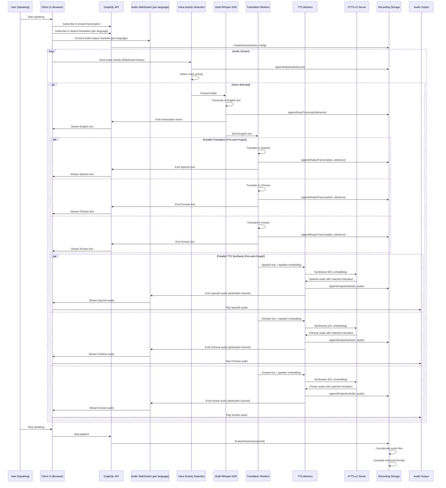

### Data Flow: Voice Input to Translated Output

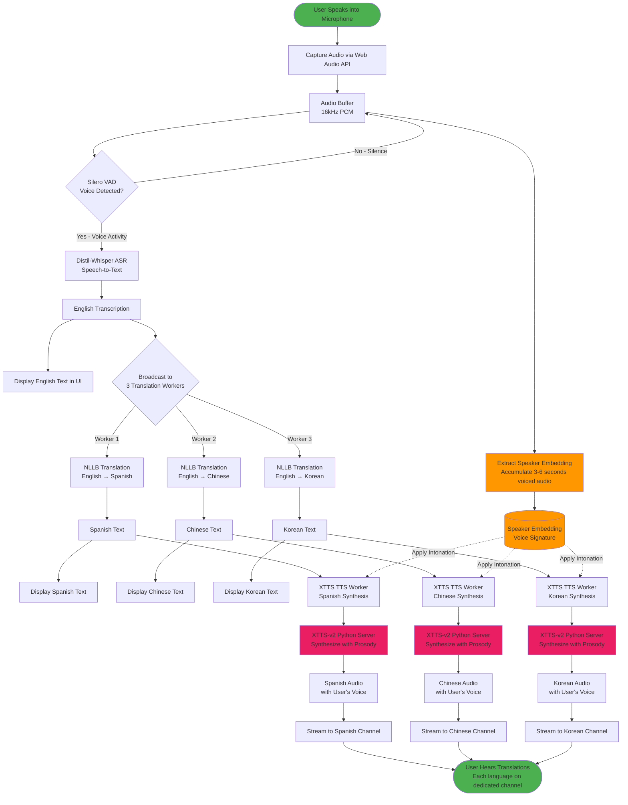

### Pipeline State Machine

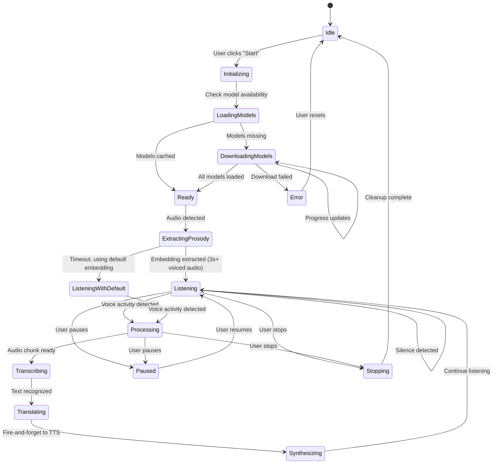

### Translation Pipeline Activity Diagram

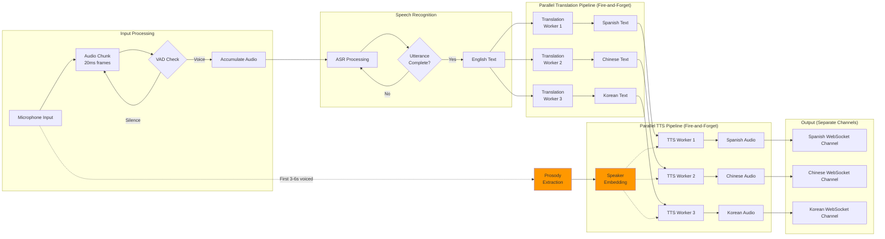

### Worker Thread Architecture (Node.js)

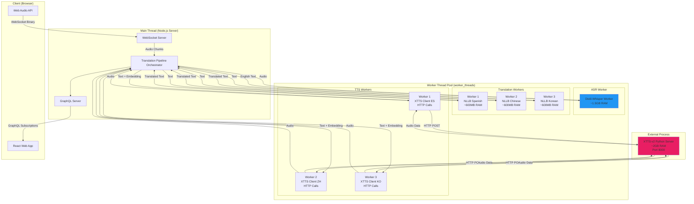

### Memory Allocation Diagram

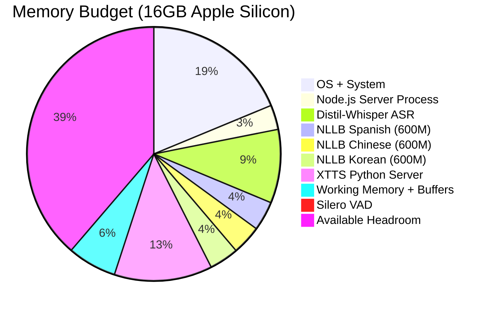

**Memory Budget Summary:**

| Component                      | Memory  | Notes                          |
| ------------------------------ | ------- | ------------------------------ |
| OS + System                    | 3.0 GB  | macOS baseline                 |
| Node.js Server Process         | 0.5 GB  | Base process + V8 heap         |
| Distil-Whisper Large V3 (ASR)  | 1.5 GB  | Via Transformers.js in Node.js |
| NLLB-200-distilled-600M × 3    | 1.8 GB  | 600MB each                     |
| XTTS-v2 Python Server          | 2.0 GB  | Separate process               |
| Silero VAD                     | 0.01 GB | Negligible                     |
| Audio buffers + working memory | 1.0 GB  | Streaming buffers              |
| React Web UI (browser, client) | —       | Runs in user's browser         |
| **Total Server**               | ~10 GB  | Leaves ~6GB headroom           |

### GraphQL + Audio WebSocket Flow

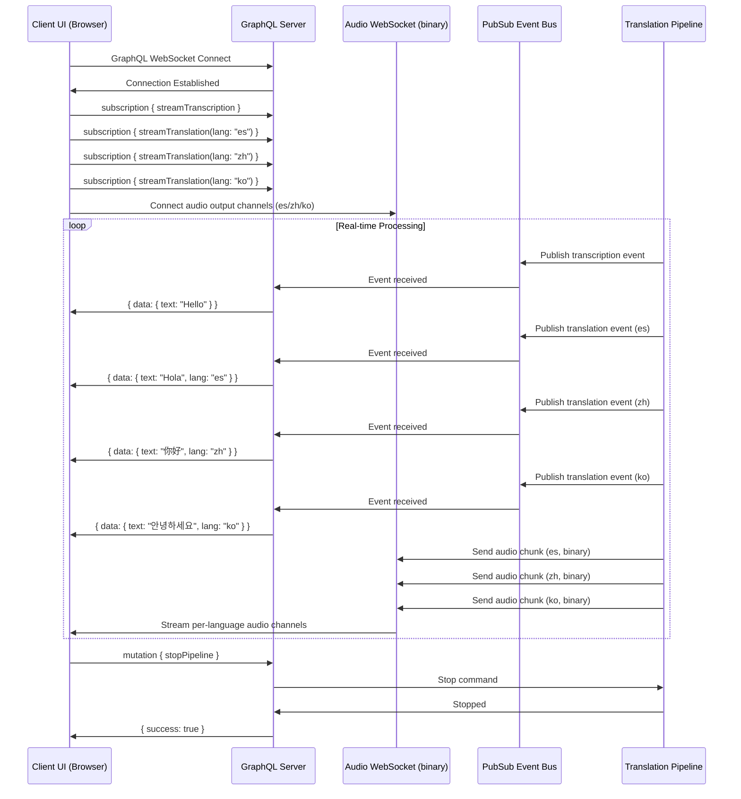

### Voice Intonation Matching Process (Primary Differentiator)

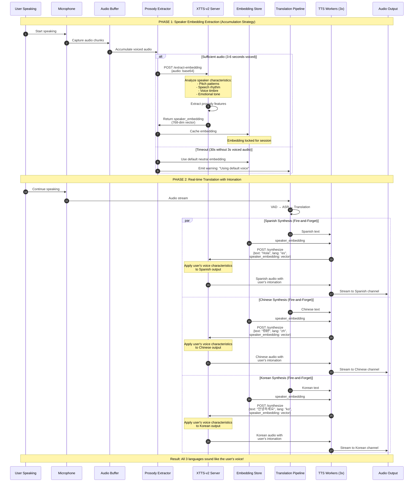

### Prosody Extraction Strategy

```
┌─────────────────────────────────────────────────────────┐
│              PROSODY EXTRACTION STRATEGY                │
├─────────────────────────────────────────────────────────┤
│                                                         │
│  Voiced Audio Duration    Action                        │
│  ────────────────────────────────────────────────────  │
│  < 1 second              Continue accumulating          │
│  1-3 seconds             Extract with quality warning   │
│  3-6 seconds             Optimal extraction             │
│  > 6 seconds             Use first 6s, stop accumulating│
│                                                         │
│  ACCUMULATION MODE:                                     │
│  - Accumulate only VOICED audio (ignore silence)        │
│  - Use VAD to filter silence from reference buffer      │
│  - Lock embedding after extraction succeeds             │
│                                                         │
│  TIMEOUT BEHAVIOR:                                      │
│  - If 30 seconds pass without 3s of voiced audio        │
│  - Use default neutral embedding                        │
│  - Emit warning to client UI                            │
│  - Continue with translation (don't block)              │
│                                                         │
│  REFRESH STRATEGY (V1):                                 │
│  - Lock embedding at session start                      │
│  - No mid-session refresh                               │
│  - User can restart session for new embedding           │
│                                                         │
└─────────────────────────────────────────────────────────┘
```

### XTTS-v2 Python Service Architecture

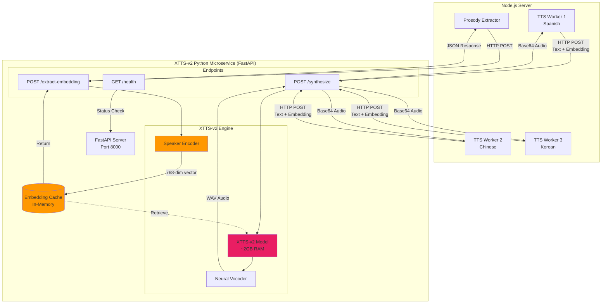

**XTTS-v2 Language Support:**

| Language        | Support Level | Notes                             |
| --------------- | ------------- | --------------------------------- |
| English (en)    | ✅ Excellent  | Primary training language         |
| Spanish (es)    | ✅ Excellent  | Well-supported                    |
| Chinese (zh-cn) | ✅ Good       | Mandarin; consider ChatTTS backup |
| Korean (ko)     | ✅ Good       | Added in XTTS-v2                  |
| + 13 more       | Varies        | See XTTS-v2 documentation         |

### Complete End-to-End Data Transformation

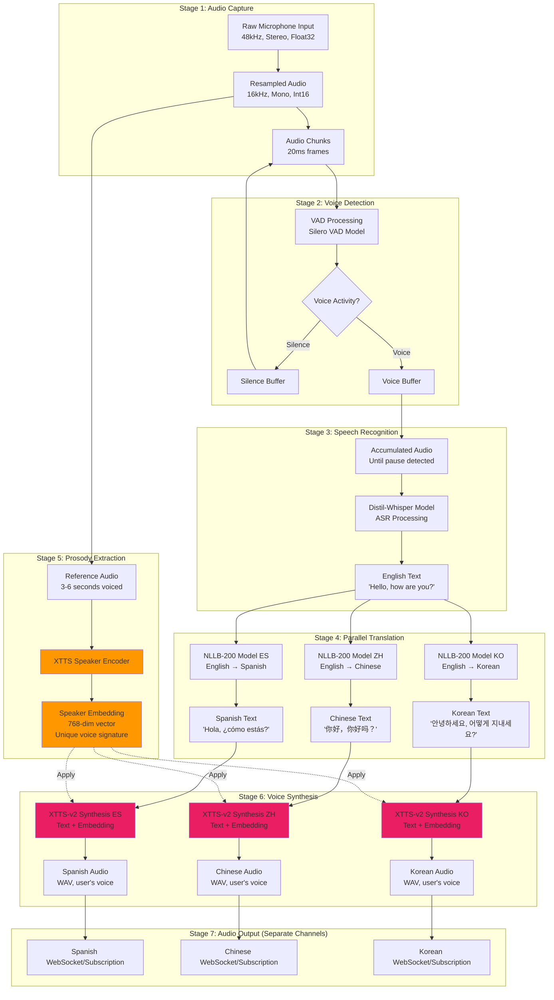

### Two-Layer Design (Server + Web Client)

**projects/server** (Translation Server - The Workhorse)

A standalone Node.js server process that can run independently:

- Pure Node.js with `worker_threads` for parallelism
- ASR, Translation, TTS, VAD service implementations
- TranslationPipeline orchestration
- Model management (on-demand downloads via Transformers.js)
- Audio processing utilities (ffmpeg for format conversion)
- GraphQL API with WebSocket subscriptions
- WebSocket server for binary audio streaming (client input + per-language output)
- Session management for multi-client support
- Can run locally or on remote machine
- Accepts audio input (live stream or file)
- Produces audio output (live stream or file download)

**projects/web-client** (Configuration & Control UI)

Lightweight React web application running in the browser:

- **Model Configuration UI**: Select ASR, Translation, TTS models
- **Session Configuration UI**:
  - Input settings (live audio from browser mic OR file upload MP3/WAV)
  - Language settings (enable/disable Spanish, Chinese, Korean)
  - Output settings (live stream per language OR save to file)
- **Server Connection**: Connect to local or remote server
- **Session Control**: Start/stop translation sessions
- **Real-time Monitoring**: Display transcription, translations, and status
- Apollo Client for GraphQL communication
- Web Audio API for microphone capture
- Separate audio players per language (no mixing)
- No heavy ML processing (all done server-side)

### Deployment Architecture

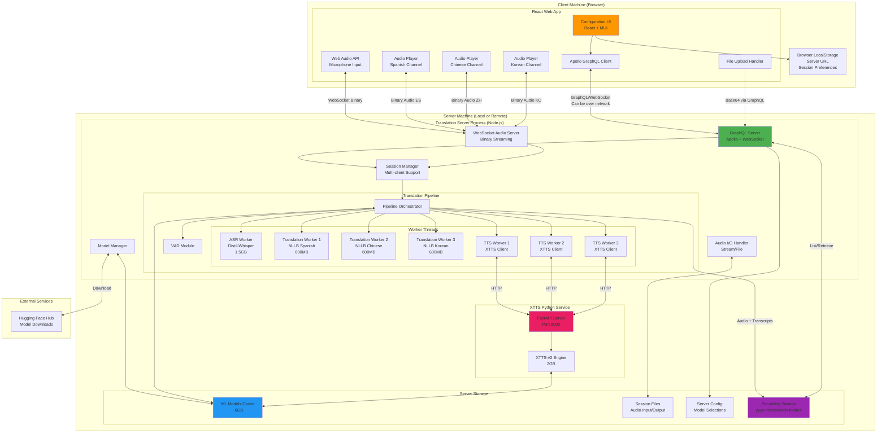

**Deployment Scenarios:**

1. **Local Deployment** (Development/Single User):

   - Client (browser) and Server both run on same machine (localhost)
   - Low latency, full resource access

2. **Remote Deployment** (Production/Multi-User):

   - Server runs on powerful machine/cloud instance (16GB+ RAM)
   - Multiple thin clients (browsers) connect remotely
   - Clients only need a modern browser, no installation

3. **LAN Deployment**:
   - Server on local network (e.g., Mac Studio with 64GB RAM)
   - Multiple users connect via LAN
   - Low latency + resource sharing

### UI Component Hierarchy (React Web App)

```mermaid
graph TB
    subgraph "Web Application UI"
        App[App.tsx<br/>Apollo Provider + Theme + Router]

        App --> Layout[MainLayout.tsx<br/>MUI Container]

        Layout --> Header[Header.tsx<br/>App Title + Server Connection]
        Layout --> Main[MainContent.tsx<br/>Tabbed Layout]

        Main --> ConfigTab[Configuration Tab]
        Main --> SessionTab[Session Tab]
        Main --> MonitorTab[Monitor Tab]
        Main --> RecordingsTab[Recordings Tab]

        subgraph "Configuration Tab Components"
            ConfigTab --> ServerConfig[ServerConnectionConfig.tsx<br/>Server URL, Connection Status]
            ConfigTab --> ModelConfig[ModelSelectionConfig.tsx<br/>ASR/Translation/TTS Model Picker]
            ConfigTab --> SaveConfig[SaveConfigButton.tsx<br/>Persist to Server]
        end

        subgraph "Session Tab Components"
            SessionTab --> SessionForm[SessionConfigForm.tsx]

            SessionForm --> InputConfig[InputSourceConfig.tsx]
            SessionForm --> LangConfig[LanguageConfig.tsx]
            SessionForm --> OutputConfig[OutputDestinationConfig.tsx]
            SessionForm --> StartSession[StartSessionButton.tsx]

            InputConfig --> LiveAudioInput[LiveAudioInput.tsx<br/>Browser Mic]
            InputConfig --> FileInput[FileInput.tsx<br/>Upload MP3/WAV as Base64]

            LangConfig --> SourceLang[SourceLanguage.tsx<br/>Default: English]
            LangConfig --> TargetLangs[TargetLanguages.tsx<br/>Enable ES/ZH/KO]

            OutputConfig --> LiveStream[LiveStreamOutput.tsx<br/>Play in Browser]
            OutputConfig --> FileOutput[FileOutput.tsx<br/>Save to File]
        end

        subgraph "Monitor Tab Components"
            MonitorTab --> SessionList[ActiveSessionsList.tsx<br/>Running Sessions]
            MonitorTab --> Display[TranslationDisplay.tsx<br/>Real-time Results]

            Display --> SourcePanel[SourceTranscription.tsx<br/>English Text Display]
            Display --> TargetPanels[TargetLanguagePanels.tsx<br/>3-Column Layout]

            TargetPanels --> SpanishPanel[SpanishPanel.tsx<br/>Text + Dedicated Audio Player]
            TargetPanels --> ChinesePanel[ChinesePanel.tsx<br/>Text + Dedicated Audio Player]
            TargetPanels --> KoreanPanel[KoreanPanel.tsx<br/>Text + Dedicated Audio Player]
        end

        subgraph "Recordings Tab Components"
            RecordingsTab --> RecordingsList[RecordingsList.tsx<br/>Browse Past Sessions]
            RecordingsTab --> RecordingDetail[RecordingDetail.tsx<br/>View Selected Recording]

            RecordingsList --> DateFilter[DateFilter.tsx<br/>Filter by Month]
            RecordingsList --> SearchFilter[SearchFilter.tsx<br/>Search by Name]

            RecordingDetail --> RecordingMeta[RecordingMetadata.tsx<br/>Duration, Languages, Date]
            RecordingDetail --> TranscriptView[TranscriptViewer.tsx<br/>Timestamped Text]
            RecordingDetail --> PlaybackControls[PlaybackControls.tsx<br/>Play/Pause/Seek]
            RecordingDetail --> LanguageSelector[LanguageSelector.tsx<br/>Select Output Language]
        end

        Layout --> Footer[Footer.tsx<br/>Status Bar]

        Footer --> ConnStatus[ConnectionStatus.tsx<br/>Server Online/Offline]
        Footer --> SessionStatus[SessionStatus.tsx<br/>Active/Idle]
        Footer --> ServerStats[ServerStats.tsx<br/>Server RAM/CPU]
    end

    subgraph "GraphQL Operations"
        Queries[Queries:<br/>- serverInfo<br/>- availableModels<br/>- sessionStatus<br/>- recordings<br/>- recording(id)<br/>- recordingTranscript]
        Mutations[Mutations:<br/>- updateServerConfig<br/>- createSession<br/>- stopSession<br/>- uploadAudioFile (base64)<br/>- deleteRecording]
        Subscriptions[Subscriptions:<br/>- streamTranscription<br/>- streamTranslation(lang)<br/>- sessionStatus]
    end

    subgraph "Audio WebSocket"
        AudioOut[Binary audio channels<br/>per target language]
    end

    ServerConfig -.->|Query| Queries
    ModelConfig -.->|Query| Queries
    ModelConfig -.->|Mutate| Mutations

    SessionForm -.->|Mutate| Mutations
    FileInput -.->|Mutate (base64)| Mutations

    Display -.->|Subscribe| Subscriptions
    SessionStatus -.->|Subscribe| Subscriptions
    ServerStats -.->|Subscribe| Subscriptions
    TargetPanels -.->|Listen| AudioOut

    RecordingsList -.->|Query| Queries
    RecordingDetail -.->|Query| Queries
    PlaybackControls -.->|Stream Audio| AudioOut

    style ConfigTab fill:#ff9800
    style SessionTab fill:#2196f3
    style MonitorTab fill:#4caf50
    style RecordingsTab fill:#9c27b0
```

### Session Configuration Flow

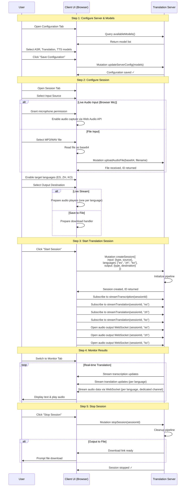

### Audio Streaming Architecture

```mermaid
graph TB
    subgraph "Client Machine (Browser)"
        ClientMic[Browser Microphone]
        FileSelect[File Selector]

        subgraph "React Web App"
            AudioCapture[Web Audio API<br/>Capture + AudioWorklet]
            FileReader[FileReader API]
            GraphQLClient[GraphQL Client<br/>Apollo]
            WSClient[WebSocket Client<br/>Audio Input (binary)]
            WSOutClient[WebSocket Client<br/>Audio Output (binary, per language)]
        end
    end

    subgraph "Server Machine"
        ServerMic[Server Audio Jack<br/>(Optional)]

        subgraph "Server Endpoints"
            GraphQLServer[GraphQL Server<br/>Port 4000]
            WSAudioServer[WebSocket Audio Server<br/>Port 4001 (in/out)]
            FileStorage[File Storage<br/>uploads/]
        end

        subgraph "Processing Pipeline"
            AudioRouter[Audio Router]
            Pipeline[Translation Pipeline]
        end
    end

    %% Scenario 1: Server Audio Device
    ServerMic -->|Direct Access| AudioRouter
    GraphQLClient -->|Mutation createSession<br/>type: SERVER_AUDIO_DEVICE| GraphQLServer
    GraphQLServer -->|Configure| AudioRouter

    %% Scenario 2: File Upload (Base64 via GraphQL)
    FileSelect --> FileReader
    FileReader -->|Base64 String| GraphQLClient
    GraphQLClient -->|Mutation uploadAudioFile<br/>content: base64| GraphQLServer
    GraphQLServer --> FileStorage
    FileStorage -->|Read File| AudioRouter

    %% Scenario 3: Client Stream (WebSocket Binary)
    ClientMic --> AudioCapture
    AudioCapture -->|PCM Chunks<br/>ArrayBuffer| WSClient
    WSClient <-->|Binary WebSocket<br/>Port 4001| WSAudioServer
    WSAudioServer -->|Stream Audio| AudioRouter

    GraphQLClient -->|Mutation createSession<br/>type: CLIENT_STREAM<br/>streamConnectionId| GraphQLServer
    GraphQLServer -->|Associate Session| WSAudioServer

    AudioRouter --> Pipeline
    Pipeline -->|Audio out (per language)| WSAudioServer
    WSAudioServer <-->|Binary WebSocket<br/>Port 4001| WSOutClient

    style ServerMic fill:#4caf50
    style FileStorage fill:#2196f3
    style WSAudioServer fill:#ff9800
```

### Audio Source Handling Details

#### **1. Server Audio Device (Lowest Latency)**

```typescript
// Client UI Configuration
const sessionInput = {
  inputSource: {
    type: "SERVER_AUDIO_DEVICE",
    deviceId: "default", // or specific device ID from server
  },
  languages: { source: "EN", targets: ["ES", "ZH", "KO"] },
  outputDestination: { type: "LIVE_STREAM" },
};

// Client sends GraphQL mutation
mutation CreateSession($input: SessionInput!) {
  createSession(input: $input) { id status }
}

// Server directly accesses audio device via node-audio or similar
// No network transmission - server processes locally
```

#### **2. File Upload (Base64 via GraphQL)**

```typescript
// Client: Select file and convert to base64
const file = document.getElementById("audioFile").files[0];
const reader = new FileReader();

reader.onload = async () => {
  const base64Content = reader.result.split(",")[1]; // Remove data URL prefix

  // Upload via GraphQL mutation
  const { data } = await apolloClient.mutate({
    mutation: UPLOAD_AUDIO_FILE,
    variables: {
      fileName: file.name,
      content: base64Content,
      mimeType: file.type,
    },
  });

  const fileId = data.uploadAudioFile.id;

  // Create session referencing uploaded file
  const sessionInput = {
    inputSource: {
      type: "FILE",
      fileId: fileId,
    },
    languages: { source: "EN", targets: ["ES", "ZH", "KO"] },
    outputDestination: { type: "FILE", format: "MP3" },
  };
};

reader.readAsDataURL(file);
```

**Server Implementation:**

```typescript
const resolvers = {
  Mutation: {
    uploadAudioFile: async (
      _,
      { fileName, content, mimeType }: UploadInput
    ) => {
      // Decode base64 content
      const buffer = Buffer.from(content, "base64");

      // Save to disk
      const id = uuid();
      const filePath = path.join("uploads", `${id}-${fileName}`);
      await fs.writeFile(filePath, buffer);

      // Analyze file (duration, format) using ffmpeg
      const metadata = await analyzeAudio(filePath);

      return {
        id,
        fileName,
        size: buffer.length,
        duration: metadata.duration,
        format: metadata.format,
      };
    },
  },
};
```

#### **3. Client Stream (WebSocket Binary - Recommended for Live Audio)**

**Client Implementation:**

```typescript
// Step 1: Connect WebSocket for audio streaming
const streamConnectionId = uuid();
const ws = new WebSocket(`ws://localhost:4001/audio/${streamConnectionId}`);
ws.binaryType = "arraybuffer";

// Step 2: Capture and send audio via Web Audio API + AudioWorklet
const audioContext = new AudioContext({ sampleRate: 16000 });
const stream = await navigator.mediaDevices.getUserMedia({ audio: true });
const source = audioContext.createMediaStreamSource(stream);

// Use AudioWorklet for low-latency processing
await audioContext.audioWorklet.addModule("/audio-processor.js");
const workletNode = new AudioWorkletNode(
  audioContext,
  "audio-stream-processor"
);

workletNode.port.onmessage = (event) => {
  const { audioData } = event.data; // Int16Array

  // Send PCM audio via WebSocket (binary)
  if (ws.readyState === WebSocket.OPEN) {
    ws.send(audioData.buffer);
  }
};

source.connect(workletNode);

// Step 3: Create session via GraphQL
const sessionInput = {
  inputSource: {
    type: "CLIENT_STREAM",
    streamConnectionId: streamConnectionId,
  },
  languages: { source: "EN", targets: ["ES", "ZH", "KO"] },
  outputDestination: { type: "LIVE_STREAM" },
};

await apolloClient.mutate({
  mutation: CREATE_SESSION,
  variables: { input: sessionInput },
});
```

**AudioWorklet Processor (audio-processor.js):**

```javascript
// Runs in audio worklet thread for low-latency processing
class AudioStreamProcessor extends AudioWorkletProcessor {
  constructor() {
    super();
    this.bufferSize = 4096;
    this.buffer = new Float32Array(this.bufferSize);
    this.bufferIndex = 0;
  }

  process(inputs, outputs, parameters) {
    const input = inputs[0];
    if (!input || !input[0]) return true;

    const channelData = input[0];

    for (let i = 0; i < channelData.length; i++) {
      this.buffer[this.bufferIndex++] = channelData[i];

      if (this.bufferIndex >= this.bufferSize) {
        // Convert Float32 to Int16 PCM
        const int16Array = new Int16Array(this.bufferSize);
        for (let j = 0; j < this.bufferSize; j++) {
          const s = Math.max(-1, Math.min(1, this.buffer[j]));
          int16Array[j] = s < 0 ? s * 0x8000 : s * 0x7fff;
        }

        // Send to main thread
        this.port.postMessage({ audioData: int16Array });

        // Reset buffer
        this.bufferIndex = 0;
      }
    }

    return true;
  }
}

registerProcessor("audio-stream-processor", AudioStreamProcessor);
```

**Server Implementation (WebSocket):**

```typescript
import { WebSocketServer } from "ws";

const audioConnections = new Map<string, WebSocket>();

const wss = new WebSocketServer({ port: 4001 });

wss.on("connection", (ws, req) => {
  // Extract streamConnectionId from URL: /audio/:id
  const streamConnectionId = req.url?.split("/audio/")[1];
  if (!streamConnectionId) {
    ws.close();
    return;
  }

  audioConnections.set(streamConnectionId, ws);

  ws.on("message", (data: Buffer) => {
    // Receive binary PCM audio data
    const audioData = new Int16Array(
      data.buffer,
      data.byteOffset,
      data.length / 2
    );

    // Route to translation pipeline
    emitAudioChunk(streamConnectionId, audioData);
  });

  ws.on("close", () => {
    audioConnections.delete(streamConnectionId);
  });
});
```

#### **4. File Path (Server-Accessible - Ideal for Testing)**

```typescript
// Client UI Configuration
const sessionInput = {
  inputSource: {
    type: "FILE_PATH",
    filePath: "/Users/tangent/test-audio/sample.wav",
    // Or network path: '/mnt/shared/audio/sample.mp3'
  },
  languages: { source: "EN", targets: ["ES", "ZH", "KO"] },
  outputDestination: { type: "FILE", format: "MP3" },
};

// Client sends GraphQL mutation
await apolloClient.mutate({
  mutation: CREATE_SESSION,
  variables: { input: sessionInput },
});
```

**Server Implementation:**

```typescript
const resolvers = {
  Mutation: {
    createSession: async (_, { input }) => {
      if (input.inputSource.type === "FILE_PATH") {
        const { filePath } = input.inputSource;

        // Validate file exists and is accessible
        if (!fs.existsSync(filePath)) {
          throw new Error(`File not found: ${filePath}`);
        }

        // Security check: prevent path traversal attacks
        const resolvedPath = path.resolve(filePath);
        const allowedPaths = [
          "/Users/tangent/test-audio",
          "/mnt/shared/audio",
          process.env.AUDIO_FILES_DIR,
        ].filter(Boolean);

        const isAllowed = allowedPaths.some((allowed) =>
          resolvedPath.startsWith(path.resolve(allowed))
        );

        if (!isAllowed) {
          throw new Error("File path not in allowed directories");
        }

        // Read file directly (no upload needed)
        const audioStream = fs.createReadStream(resolvedPath);

        // Route to translation pipeline
        return await processAudioFile(audioStream, input);
      }
    },
  },
};
```

### Protocol Comparison

| Aspect            | Server Device  | File Upload (Base64)      | File Path           | Client Stream (WebSocket) |
| ----------------- | -------------- | ------------------------- | ------------------- | ------------------------- |
| **Latency**       | Lowest (~10ms) | N/A (batch)               | N/A (batch)         | Low (~50ms)               |
| **Network Usage** | None           | One-time upload           | None                | Continuous (~64kbps)      |
| **Use Case**      | Server has mic | Remote file processing    | Local/shared FS     | Remote real-time          |
| **GraphQL Role**  | Session config | Upload + session config   | Session config      | Session config            |
| **Transport**     | Local device   | GraphQL mutation (base64) | Local filesystem    | WebSocket binary          |
| **Complexity**    | Low            | Low                       | Low                 | Low-Medium                |
| **Best For**      | Local setup    | Remote clients            | Testing/development | Production real-time      |

### GraphQL Schema

Audio output is delivered over dedicated binary WebSocket channels; the GraphQL schema below covers control and text streaming only.

```graphql
# ============================================
# Server Configuration
# ============================================

type ServerInfo {
  version: String!
  status: ServerStatus!
  capabilities: ServerCapabilities!
  resources: ResourceUsage!
}

type ServerStatus {
  online: Boolean!
  modelsLoaded: Boolean!
  activeSessionsCount: Int!
}

type ServerCapabilities {
  supportedLanguages: [Language!]!
  availableModels: ModelCatalog!
  maxConcurrentSessions: Int!
}

type ModelCatalog {
  asr: [ModelInfo!]!
  translation: [ModelInfo!]!
  tts: [ModelInfo!]!
  vad: [ModelInfo!]!
}

type ModelInfo {
  id: ID!
  name: String!
  size: String!
  downloaded: Boolean!
  loaded: Boolean!
}

type ResourceUsage {
  memoryUsed: Float!
  memoryTotal: Float!
  cpuPercent: Float!
}

enum Language {
  EN
  ES
  ZH
  KO
}

# ============================================
# Session Configuration
# ============================================

input SessionInput {
  inputSource: InputSourceConfig!
  languages: LanguageConfig!
  outputDestination: OutputDestinationConfig!
}

input InputSourceConfig {
  type: InputType!
  fileId: ID # For FILE type
  deviceId: String # For SERVER_AUDIO_DEVICE type
  streamConnectionId: String # For CLIENT_STREAM type
  filePath: String # For FILE_PATH type (server-accessible path)
}

enum InputType {
  SERVER_AUDIO_DEVICE # Audio jack directly on server
  FILE # Client uploads MP3/WAV via base64
  FILE_PATH # Server reads from accessible file path (local/network)
  CLIENT_STREAM # Real-time audio from client's microphone via WebSocket
}

input LanguageConfig {
  source: Language!
  targets: [Language!]!
}

input OutputDestinationConfig {
  type: OutputType!
  format: AudioFormat
}

enum OutputType {
  LIVE_STREAM
  FILE
}

enum AudioFormat {
  WAV
  MP3
  FLAC
}

# ============================================
# Session Management
# ============================================

type Session {
  id: ID!
  status: SessionStatus!
  config: SessionConfig!
  createdAt: String!
  startedAt: String
  completedAt: String
  outputFileUrl: String
}

type SessionConfig {
  inputSource: InputSourceInfo!
  languages: LanguageConfigOutput!
  outputDestination: OutputDestinationInfo!
}

type InputSourceInfo {
  type: InputType!
  fileName: String
  duration: Float
}

type LanguageConfigOutput {
  source: Language!
  targets: [Language!]!
}

type OutputDestinationInfo {
  type: OutputType!
  format: AudioFormat
}

enum SessionStatus {
  CREATED
  INITIALIZING
  EXTRACTING_PROSODY
  RUNNING
  PAUSED
  COMPLETING
  COMPLETED
  ERROR
}

# ============================================
# Real-time Streaming Data (GraphQL - text/control)
# ============================================

type TranscriptionUpdate {
  sessionId: ID!
  timestamp: Float!
  text: String!
  isFinal: Boolean!
}

type TranslationUpdate {
  sessionId: ID!
  language: Language!
  timestamp: Float!
  text: String!
}

type SessionStatusUpdate {
  sessionId: ID!
  status: SessionStatus!
  progress: Float
  message: String
}

# ============================================
# Queries
# ============================================

type Query {
  # Server information
  serverInfo: ServerInfo!

  # Model management
  availableModels: ModelCatalog!
  modelInfo(id: ID!): ModelInfo

  # Session queries
  session(id: ID!): Session
  activeSessions: [Session!]!
  sessionHistory(limit: Int = 10): [Session!]!
}

# ============================================
# Mutations
# ============================================

type Mutation {
  # Server configuration
  updateServerConfig(models: ModelSelectionInput!): ServerInfo!
  downloadModel(modelId: ID!): ModelDownloadJob!

  # File upload (base64)
  uploadAudioFile(
    fileName: String!
    content: String!
    mimeType: String!
  ): AudioFile!

  # Session management
  createSession(input: SessionInput!): Session!
  startSession(id: ID!): Session!
  pauseSession(id: ID!): Session!
  resumeSession(id: ID!): Session!
  stopSession(id: ID!): Session!
  deleteSession(id: ID!): Boolean!
}

input ModelSelectionInput {
  asr: ID
  translation: ID
  tts: ID
  vad: ID
}

type ModelDownloadJob {
  modelId: ID!
  progress: Float!
  status: DownloadStatus!
}

enum DownloadStatus {
  QUEUED
  DOWNLOADING
  COMPLETED
  FAILED
}

type AudioFile {
  id: ID!
  fileName: String!
  size: Int!
  duration: Float!
  format: AudioFormat!
}

# ============================================
# Subscriptions
# ============================================

type Subscription {
  # Real-time translation streaming (separate channels per language)
  streamTranscription(sessionId: ID!): TranscriptionUpdate!
  streamTranslation(sessionId: ID!, language: Language!): TranslationUpdate!

  # Session status updates
  sessionStatus(sessionId: ID!): SessionStatusUpdate!

  # Server monitoring
  serverStats: ResourceUsage!

  # Model download progress
  modelDownloadProgress(modelId: ID!): ModelDownloadJob!
}
```

### Model Loading & Caching Flow

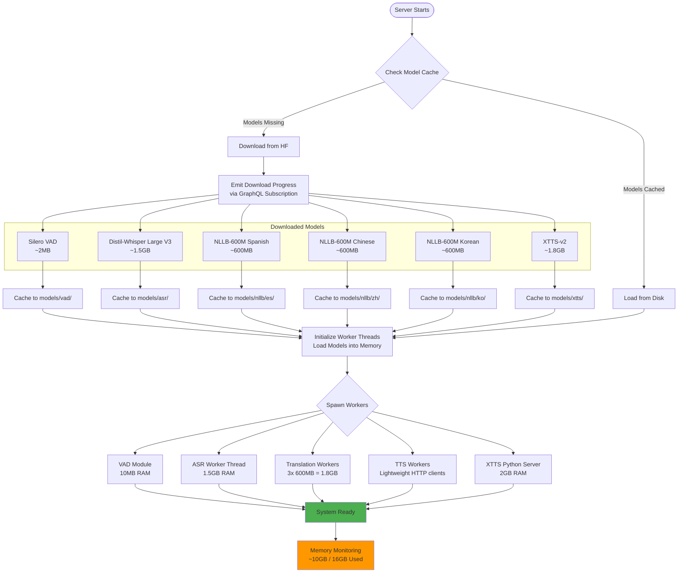

### Error Handling & Recovery Flow

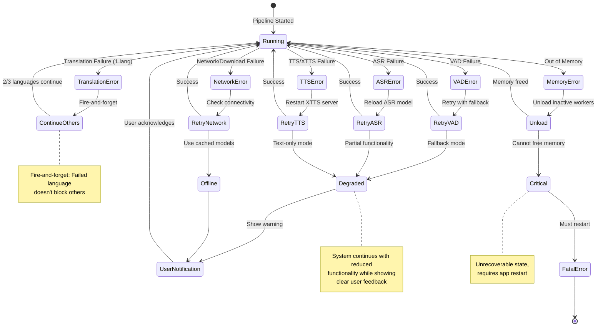

### Key Technical Decisions

1. **Pure Node.js Server**: Server runs as a standalone Node.js process with `worker_threads` for parallelism. No browser context on server side.
2. **React Web Client**: Client is a standard React web app running in the user's browser. No Electron.
3. **WebSocket for Audio Streaming**: Simple WebSocket binary transport for live audio from client to server. No WebRTC complexity.
4. **Separate Audio Channels**: Each target language has its own WebSocket/GraphQL subscription channel. No mixing.
5. **Fire-and-Forget Translation**: Languages don't block each other. If Spanish fails, Chinese and Korean continue.
6. **XTTS-v2 as Python Microservice**: No mature TypeScript implementation exists; Python backend with HTTP API required for prosody extraction.
7. **NLLB-200 Distilled (600M)**: Fits 3 instances in memory (~1.8GB total).
8. **Distil-Whisper Large V3**: Best accuracy/speed tradeoff available in Transformers.js. Parakeet TDT not available.
9. **GraphQL Subscriptions**: Standard protocol for multi-client real-time streaming over network.
10. **On-Demand Model Downloads**: Transformers.js auto-download, cached in server's `models/` directory.
11. **Base64 File Upload**: Simple GraphQL mutation for file uploads instead of multipart.
12. **ffmpeg via npm**: Use `@ffmpeg-installer/ffmpeg` + `fluent-ffmpeg` for audio format conversion.
13. **Recording Storage Abstraction**: `IRecordingStorage` interface enables pluggable backends (filesystem, cloud, database).
14. **Automatic Session Recording**: All sessions recorded by default with incremental writes during processing.
15. **Multiple Transcript Formats**: Plain text, timestamped, JSON, and SRT formats generated during finalization.

### Benefits of Client-Server Architecture

**Scalability:**

- Single powerful server (64GB RAM) can serve multiple lightweight browser clients
- Easy horizontal scaling by adding more server instances
- Clients require only a modern browser (no installation, no GPU, minimal RAM)

**Flexibility:**

- Server can run locally (localhost) for development/personal use
- Server can run on remote machine/cloud for production
- Server can run on LAN for team collaboration
- Mix and match: different users can use different input/output modes simultaneously

**Separation of Concerns:**

- **Client (Browser)**: Configuration UI, session management, monitoring

  - Easy to update UI without touching ML code
  - Standard web technologies (React, Apollo Client)
  - Works on any device with a modern browser

- **Server (Node.js)**: ML processing, model management, pipeline orchestration
  - Focus on performance and accuracy
  - Independent testing and optimization
  - Can upgrade models without client changes

**Development Workflow:**

- Frontend developers work on client without needing ML expertise
- ML engineers work on server without touching UI code
- Independent deployment and versioning
- Easier testing (mock server for client tests, mock client for server tests)

**Use Cases Enabled:**

1. **Personal Use**: Browser pointing to localhost server
2. **Team Use**: Server on Mac Studio, multiple team members connect via LAN
3. **Cloud Deployment**: Server on AWS/GCP, clients anywhere with internet
4. **Batch Processing**: Upload files via browser, server processes, download results
5. **Multi-Session**: One user runs live translation while another processes files

### Recording Storage Architecture

Recording storage enables replay of translation sessions and supports pluggable storage backends.

#### Storage Interface

```typescript
interface IRecordingStorage {
  // Session lifecycle
  createSession(name: string, config: SessionConfig): Promise<RecordingSession>;
  finalizeSession(sessionId: string): Promise<RecordingMetadata>;

  // Input recording
  appendInputAudio(sessionId: string, audio: Buffer, utteranceId?: string): Promise<void>;
  appendInputTranscript(sessionId: string, utterance: TranscriptEntry): Promise<void>;

  // Output recording (per language)
  appendOutputAudio(sessionId: string, language: string, audio: Buffer, utteranceId?: string): Promise<void>;
  appendOutputTranscript(sessionId: string, language: string, utterance: TranscriptEntry): Promise<void>;

  // Speaker embedding
  saveSpeakerEmbedding(sessionId: string, embedding: Buffer): Promise<void>;
  getSpeakerEmbedding(sessionId: string): Promise<Buffer | null>;

  // Retrieval
  getSession(sessionId: string): Promise<RecordingSession | null>;
  listSessions(filter?: SessionFilter): Promise<RecordingMetadata[]>;

  // Playback helpers
  getInputAudio(sessionId: string): Promise<ReadableStream>;
  getOutputAudio(sessionId: string, language: string): Promise<ReadableStream>;
  getUtteranceAudio(sessionId: string, utteranceId: string, language?: string): Promise<Buffer>;
}

interface TranscriptEntry {
  utteranceId: string;
  startTime: number;
  endTime: number;
  text: string;
  confidence?: number;
  isFinal: boolean;
}
```

#### Folder Structure (Local Filesystem)

```
{basePath}/
└── 2025-12/                                      # Year-Month grouping
    └── 2025-12-15-14-30-45-meeting-with-john/    # Session folder
        ├── session.json                          # Session metadata
        ├── embedding.bin                         # Speaker embedding
        ├── input/
        │   ├── audio.wav                         # Concatenated input
        │   ├── transcript.txt                    # Plain text
        │   ├── transcript.timestamps.txt         # With timestamps
        │   ├── transcript.json                   # Structured JSON
        │   └── chunks/                           # Per-utterance
        │       ├── utt-001.wav
        │       └── utt-002.wav
        ├── es/
        │   ├── audio.wav
        │   ├── transcript.txt
        │   ├── transcript.timestamps.txt
        │   ├── transcript.json
        │   ├── transcript.srt                    # SRT subtitles
        │   └── chunks/
        ├── zh/
        │   └── (same structure)
        └── ko/
            └── (same structure)
```

#### Recording Flow Integration

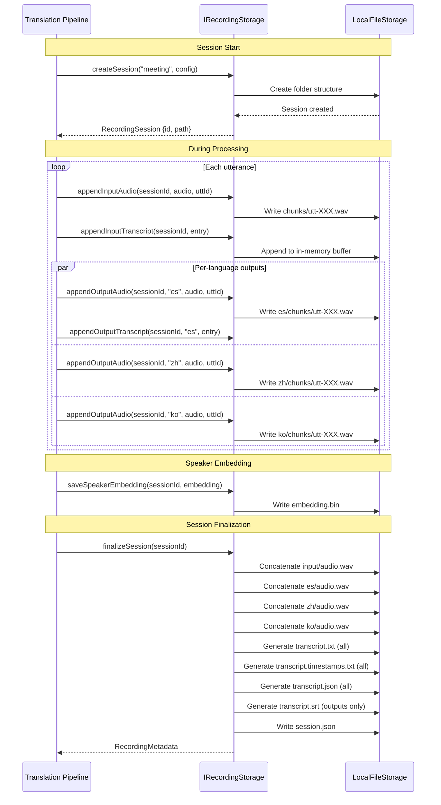

#### Transcript Format Examples

**Plain Text (transcript.txt)**:
```
Hello, how are you today?
I'm doing well, thank you for asking.
```

**Timestamped (transcript.timestamps.txt)**:
```
[00:00.000 - 00:02.500] Hello, how are you today?
[00:03.200 - 00:06.100] I'm doing well, thank you for asking.
```

**Structured JSON (transcript.json)**:
```json
{
  "utterances": [
    {
      "id": "utt-001",
      "startTime": 0.0,
      "endTime": 2.5,
      "text": "Hello, how are you today?",
      "confidence": 0.95
    }
  ]
}
```

**SRT Subtitles (transcript.srt)** - For translated outputs:
```
1
00:00:00,000 --> 00:00:02,500
Hola, ¿cómo estás hoy?

2
00:00:03,200 --> 00:00:06,100
Estoy bien, gracias por preguntar.
```

#### Session Metadata (session.json)

```json
{
  "id": "uuid-here",
  "name": "meeting-with-john",
  "createdAt": "2025-12-15T14:30:45Z",
  "completedAt": "2025-12-15T14:45:30Z",
  "duration": 885.5,
  "sourceLanguage": "en",
  "targetLanguages": ["es", "zh", "ko"],
  "inputSource": "CLIENT_STREAM",
  "status": "completed",
  "utteranceCount": 42,
  "speakerEmbeddingExtracted": true,
  "files": {
    "input": {
      "audio": "input/audio.wav",
      "chunks": 42
    },
    "outputs": {
      "es": { "audio": "es/audio.wav", "chunks": 42 },
      "zh": { "audio": "zh/audio.wav", "chunks": 42 },
      "ko": { "audio": "ko/audio.wav", "chunks": 42 }
    }
  }
}
```

#### GraphQL Extensions for Recording

```graphql
# Additional types for recording
type Recording {
  id: ID!
  name: String!
  createdAt: String!
  completedAt: String
  duration: Float!
  sourceLanguage: Language!
  targetLanguages: [Language!]!
  status: RecordingStatus!
  utteranceCount: Int!
}

enum RecordingStatus {
  RECORDING
  FINALIZING
  COMPLETED
  FAILED
}

type RecordingTranscript {
  utterances: [TranscriptUtterance!]!
}

type TranscriptUtterance {
  id: ID!
  startTime: Float!
  endTime: Float!
  text: String!
  confidence: Float
}

# Additional queries
extend type Query {
  recordings(filter: RecordingFilter): [Recording!]!
  recording(id: ID!): Recording
  recordingTranscript(id: ID!, language: Language): RecordingTranscript!
}

input RecordingFilter {
  startDate: String
  endDate: String
  name: String
  status: RecordingStatus
}

# Additional mutations
extend type Mutation {
  deleteRecording(id: ID!): Boolean!
}
```

## Implementation Roadmap

### Phase 1: Foundation & Core Abstractions

**Environment Setup with ASDF**

- Install ASDF version manager: <https://asdf-vm.com/guide/getting-started.html>
- Create `.tool-versions` file in repository root:

  ```text
  nodejs 20.11.1
  python 3.11.8
  poetry 1.8.2
  pnpm 10.7.0
  ```

- Install ASDF plugins:

  ```bash
  asdf plugin add nodejs https://github.com/asdf-vm/asdf-nodejs.git
  asdf plugin add python https://github.com/asdf-community/asdf-python.git
  asdf plugin add poetry https://github.com/asdf-community/asdf-poetry.git
  asdf plugin add pnpm https://github.com/jonathanmorley/asdf-pnpm.git
  ```

- Bootstrap environment: `asdf install` (reads `.tool-versions` and installs all runtimes)
- Verify installations:

  ```bash
  node --version    # 20.11.1
  python --version  # 3.11.8
  poetry --version  # 1.8.2
  pnpm --version    # 10.7.0
  ```

**Setup TypeScript & Dependencies**

- Create `tsconfig.base.json` and per-package configs (strict mode enabled)
- Update `package.json` files with dependencies:
  - `@huggingface/transformers` (Transformers.js for Node.js)
  - `@ffmpeg-installer/ffmpeg` + `fluent-ffmpeg` (audio processing)
  - `ws` (WebSocket server)
  - `@apollo/server` + `graphql-ws` (GraphQL)
  - `comlink` (worker thread communication)
- Run `pnpm install` across monorepo

**Core Interfaces** (`projects/server/src/interfaces/`)

- `IASR.ts` - ASR abstraction with streaming support
- `ITranslator.ts` - Translation abstraction for NLLB-200
- `ITTS.ts` - TTS abstraction with speaker embedding support (critical for XTTS-v2)
- `IVAD.ts` - Voice activity detection interface
- `IModelManager.ts` - Model download and caching interface

**ModelManager Implementation**

- `ModelRegistry.ts` - Metadata for Distil-Whisper, NLLB-200, XTTS-v2, Silero VAD
- `ModelManager.ts` - On-demand download via Transformers.js, cache management
- Test with small model (Silero VAD ~2MB)

**Deliverables**: Compilable server package, working model download system, first boundary tests

### Phase 2: ASR + VAD

**Voice Activity Detection**

- Implement `SileroVAD.ts` using `@ricky0123/vad-node` (Node.js variant)
- Test with audio fixtures (silence vs speech)

**Speech Recognition**

- Implement `DistilWhisperASR.ts` using Transformers.js
- Model: `distil-whisper/distil-large-v3`
- Streaming transcription with partial/final results
- Handle 16kHz audio resampling

**Audio Utilities** (`projects/server/src/audio/`)

- `AudioBuffer.ts` - Circular buffer for streaming
- `AudioConverter.ts` - WAV/MP3 format conversion using fluent-ffmpeg
- `AudioResampler.ts` - Resample to 16kHz for ASR

**Deliverables**: Working VAD and ASR with boundary tests, audio processing pipeline

### Phase 3: Translation with Worker Threads

**NLLB Translator**

- Implement `NLLBTranslator.ts` for English → Spanish/Chinese/Korean
- Model: `facebook/nllb-200-distilled-600M`
- Single-shot translation first, then streaming

**Worker Thread Architecture**

- `translation.worker.ts` - Isolated NLLB instance per language
- `worker-pool.ts` - Manage 3 parallel workers with task queuing
- Use Comlink for simplified message passing between main thread and workers

**Memory Profiling**

- Load 3 NLLB instances simultaneously
- Verify memory usage ~1.8GB for all translations

**Deliverables**: Parallel translation for 3 languages, memory benchmarks

### Phase 4: XTTS-v2 Intonation Matching **[PRIMARY DIFFERENTIATOR]**

**Python Backend Setup**

- Create `xtts-server/` with FastAPI service
- Endpoints: `/extract-embedding`, `/synthesize`, `/health`
- Use TTS library (`pip install TTS`) for XTTS-v2 prosody extraction
- Development server: `uvicorn main:app --reload --host 0.0.0.0 --port 8000`

**TypeScript Client**

- Implement `XTTSClient.ts` - HTTP client to Python backend
- `ProsodyExtractor.ts` - Helper for speaker embedding management
- Implement accumulation strategy (3-6 seconds of voiced audio)

**Intonation Matching Flow**

1. User speaks (English audio captured)
2. Accumulate voiced audio (VAD-filtered) until 3-6 seconds
3. Extract speaker embedding from reference audio
4. Store embedding in pipeline context (locked for session)
5. Pass embedding to all TTS synthesis calls
6. Verify prosody preservation across Spanish/Chinese/Korean output

**TTS Worker Pool**

- `tts.worker.ts` - Calls XTTS API (lightweight HTTP calls)
- 3 workers for parallel synthesis

**Deliverables**: Working intonation matching, demo showing voice preservation

### Phase 5: Pipeline Orchestration

**TranslationPipeline**

- Orchestrate VAD → ASR → Translation (3 langs) → TTS (3 langs)
- Fire-and-forget architecture (languages don't block each other)
- Manage worker lifecycle and error handling
- Async generator architecture for streaming

**PipelineContext**

- Shared state: speaker embedding, session config, active languages
- Event bus for status updates (PubSub)

**End-to-End Testing**

- Full pipeline test with real audio
- Measure latency (target: <4s end-to-end)
- Profile memory usage (target: <10GB total)

**Deliverables**: Working pipeline, performance benchmarks

### Phase 6: GraphQL API & WebSocket Server

**Schema Definition** (`projects/server/src/schema/schema.graphql`)

- Queries: `serverInfo`, `availableModels`, `session`, `activeSessions`
- Mutations: `createSession`, `stopSession`, `uploadAudioFile`, `downloadModel`
- Subscriptions: `streamTranscription`, `streamTranslation`, `sessionStatus`

**Apollo Server Setup**

- Configure Express + WebSocket server with `graphql-ws`
- Implement resolvers (thin wrappers around Core services)
- Setup PubSub for subscription events

**WebSocket Audio Server**

- Separate WebSocket server on port 4001 for binary audio streaming (input + per-language output)
- Handle `streamConnectionId` association with GraphQL sessions

**Session Management**

- `SessionManager.ts` - Track client sessions, cleanup on disconnect
- Support multiple concurrent clients

**Deliverables**: Running GraphQL server, WebSocket audio server, working subscriptions, integration tests

### Phase 7: React Web Client

**Vite + React Setup**

- `projects/web-client/` with Vite configuration
- React 18 + TypeScript + MUI

**React + MUI Components**

- `TranscriptionView` - Live English transcription display
- `TranslationView` - 3-panel layout for Spanish/Chinese/Korean (separate audio players)
- `AudioControls` - Start/stop, volume, language selection
- `ModelStatus` - Download progress indicators
- `ServerConnection` - Server URL configuration

**Apollo Client Integration**

- GraphQL subscriptions for real-time text/status updates
- State management with Zustand or React Context

**Audio I/O**

- Microphone access via Web Audio API
- AudioWorklet for low-latency capture
- Separate audio players per language (no mixing)
- WebSocket client for binary audio streaming to server
- WebSocket clients for receiving per-language audio output (binary)

**Deliverables**: Working React web app with live translation UI

### Phase 8: Recording Storage & Playback

**Storage Abstraction Layer**

- Implement `IRecordingStorage` interface for pluggable storage backends
- Create `LocalFileStorage` implementation (filesystem-based)
- Configure base path via environment variable or config file

**Recording During Sessions**

- Integrate storage hooks into TranslationPipeline
- Write input audio chunks incrementally (both raw stream and per-utterance)
- Write output audio per language (both concatenated and per-utterance)
- Save transcripts incrementally during session
- Extract and store speaker embedding after extraction

**Session Finalization**

- Concatenate per-utterance audio into full audio files
- Generate all transcript formats:
  - Plain text (`transcript.txt`)
  - Timestamped text (`transcript.timestamps.txt`)
  - Structured JSON (`transcript.json`)
  - SRT subtitles (`transcript.srt`) for translated outputs
- Write `session.json` metadata file
- Update session status to 'completed'

**Folder Structure Implementation**

```
{basePath}/
└── {yyyy-mm}/
    └── {yyyy-mm-dd-hh-mm-ss}-{name}/
        ├── session.json
        ├── embedding.bin
        ├── input/
        │   ├── audio.wav
        │   ├── transcript.txt
        │   ├── transcript.timestamps.txt
        │   ├── transcript.json
        │   └── chunks/
        ├── es/
        │   ├── audio.wav
        │   ├── transcript.txt
        │   ├── transcript.timestamps.txt
        │   ├── transcript.json
        │   ├── transcript.srt
        │   └── chunks/
        ├── zh/
        │   └── (same structure)
        └── ko/
            └── (same structure)
```

**Playback Support**

- Add GraphQL queries for listing and retrieving recordings
- Stream audio files for playback in client
- Load and display transcripts with timestamps

**Deliverables**: Complete recording system with local filesystem storage

### Phase 9: Testing & Optimization

**Comprehensive Testing**

- Boundary tests for all server modules
- API resolver integration tests
- Client component tests
- Recording storage tests (create, finalize, retrieve)

**Performance Optimization**

- Profile and optimize bottlenecks
- Reduce memory footprint where possible
- Tune chunk sizes for optimal latency
- Optimize audio concatenation for large files

**Error Handling**

- Graceful degradation on translation failures (fire-and-forget)
- Retry logic for model loading
- User-friendly error messages
- Handle storage failures without blocking pipeline

**Deliverables**: Production-ready code with test coverage

## Memory Budget (16GB Apple Silicon)

**Allocation Strategy**:

| Component                     | Memory  | Notes                          |
| ----------------------------- | ------- | ------------------------------ |
| OS + System                   | 3.0 GB  | macOS baseline                 |
| Node.js Server Process        | 0.5 GB  | Base process + V8 heap         |
| Distil-Whisper Large V3 (ASR) | 1.5 GB  | Via Transformers.js in Node.js |
| NLLB-200-distilled-600M × 3   | 1.8 GB  | 600MB each                     |
| XTTS-v2 (Python backend)      | 2.0 GB  | Separate process               |
| Silero VAD                    | 0.01 GB | Negligible                     |
| Working memory + buffers      | 1.0 GB  | Streaming buffers              |
| **Total Server**              | ~10 GB  | Leaves ~6GB headroom           |

**Note**: React web client runs in user's browser, not counted against server memory.

**Optimizations**:

- Use quantized models if available (int8 reduces NLLB further)
- Lazy load/unload inactive language models
- Worker thread isolation prevents memory leaks
- Implement memory monitoring with alerts

## Critical Files to Create (Priority Order)

### Immediate - Phase 1

1. **`tsconfig.base.json`** - Root TypeScript configuration
2. **`projects/server/tsconfig.json`** - Server package TypeScript config
3. **`projects/server/package.json`** - Update with dependencies (@huggingface/transformers, @ffmpeg-installer/ffmpeg, fluent-ffmpeg, ws, comlink)
4. **`projects/server/vite.config.ts`** - Build configuration for Node.js
5. **`projects/server/src/interfaces/ITTS.ts`** - TTS interface (critical for intonation matching)
6. **`projects/server/src/interfaces/IASR.ts`** - ASR interface
7. **`projects/server/src/interfaces/ITranslator.ts`** - Translation interface
8. **`projects/server/src/interfaces/IModelManager.ts`** - Model management interface
9. **`projects/server/src/services/model-manager/ModelRegistry.ts`** - Model metadata
10. **`projects/server/src/services/model-manager/ModelManager.ts`** - Download/cache logic

### High Priority - Phase 2-3

11. **`projects/server/src/services/vad/SileroVAD.ts`** - VAD implementation
12. **`projects/server/src/services/asr/DistilWhisperASR.ts`** - ASR implementation
13. **`projects/server/src/services/translation/NLLBTranslator.ts`** - Translation implementation
14. **`projects/server/src/workers/translation.worker.ts`** - Worker thread for translation
15. **`projects/server/src/workers/worker-pool.ts`** - Worker pool manager

### Critical for Differentiator - Phase 4

16. **`xtts-server/main.py`** - XTTS-v2 Python backend (FastAPI)
17. **`xtts-server/pyproject.toml`** - Python dependencies (Poetry)
18. **`projects/server/src/services/tts/XTTSClient.ts`** - XTTS HTTP client
19. **`projects/server/src/services/tts/ProsodyExtractor.ts`** - Speaker embedding helper

### Pipeline & API - Phase 5-6

20. **`projects/server/src/pipeline/TranslationPipeline.ts`** - Main orchestration
21. **`projects/server/src/schema/schema.graphql`** - GraphQL schema
22. **`projects/server/src/server.ts`** - Apollo Server + WebSocket setup
23. **`projects/server/src/resolvers/Subscription.ts`** - Streaming resolvers

### Client - Phase 7

24. **`projects/web-client/vite.config.ts`** - Vite configuration for React
25. **`projects/web-client/src/apollo/client.ts`** - Apollo Client setup
26. **`projects/web-client/src/components/TranslationView/TranslationView.tsx`** - Main UI

### Recording Storage - Phase 8

27. **`projects/server/src/interfaces/IRecordingStorage.ts`** - Storage abstraction interface
28. **`projects/server/src/services/storage/LocalFileStorage.ts`** - Filesystem implementation
29. **`projects/server/src/services/storage/TranscriptFormatter.ts`** - Generate txt/json/srt formats
30. **`projects/server/src/services/storage/AudioConcatenator.ts`** - Merge audio chunks
31. **`projects/server/src/services/storage/SessionFinalizer.ts`** - Finalization logic

## Immediate Next Steps

To begin implementation immediately:

1. **Update package.json files** with confirmed dependencies
2. **Create TypeScript configurations** (root + per-package)
3. **Run `pnpm install`** to install all dependencies
4. **Create server interface files** (IASR, ITranslator, ITTS, IVAD, IModelManager)
5. **Implement ModelManager** with on-demand download logic
6. **Write first boundary test** for ModelManager
7. **Verify model download** works with Silero VAD (small 2MB model)

## Summary

This plan provides a clear, actionable path to building Voice Bridge with all ambiguities resolved:

**Confirmed Decisions:**

- ✅ Pure Node.js server with `worker_threads` (not Web Workers)
- ✅ React web client in browser (not Electron)
- ✅ WebSocket binary for audio streaming in/out (not WebRTC; audio not sent over GraphQL)
- ✅ Distil-Whisper Large V3 for ASR (Parakeet TDT not available in Transformers.js)
- ✅ NLLB-200-distilled-600M for translation (~600MB per language)
- ✅ On-demand model downloads (not bundled)
- ✅ Multi-client GraphQL API with subscriptions (text/control only)
- ✅ All 3 languages (Spanish, Chinese, Korean) from start
- ✅ Voice intonation matching as PRIMARY goal (XTTS-v2)
- ✅ Separate audio channels per language (no mixing)
- ✅ Fire-and-forget translation (languages don't block each other)
- ✅ Base64 file upload via GraphQL (not multipart)
- ✅ ffmpeg via npm (`@ffmpeg-installer/ffmpeg`)
- ✅ Cross-platform production, Apple Silicon primary testing
- ✅ Memory budget: ~10GB server, ~6GB headroom on 16GB machine
- ✅ Boundary tests for each module
- ✅ Recording storage with abstraction layer (IRecordingStorage)
- ✅ Local filesystem storage with year-month folder grouping
- ✅ Both per-utterance and concatenated audio files
- ✅ Multiple transcript formats (plain text, timestamped, JSON, SRT)
- ✅ Speaker embedding saved for future re-synthesis

**Key Success Factors:**

1. XTTS-v2 Python backend for prosody extraction
2. Worker thread parallelism for 3 simultaneous translations
3. Memory management to stay under 10GB
4. GraphQL subscriptions for text/control; binary WebSockets for audio
5. Clean Server/Client separation
6. Prosody extraction with accumulation strategy and fallback
7. Recording storage abstraction for pluggable backends

The project is ambitious but feasible, with XTTS-v2 intonation matching providing clear differentiation. The phased approach ensures steady progress with testable milestones.
